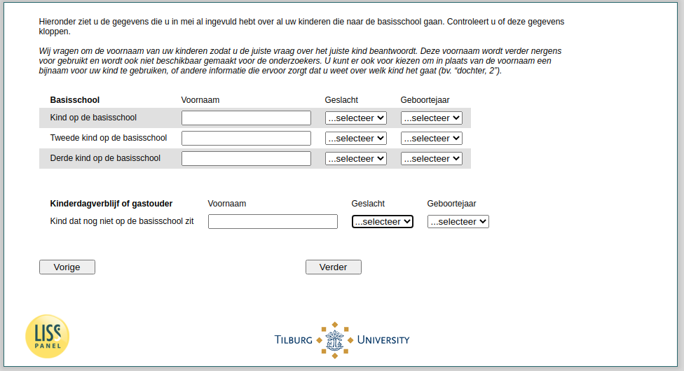

.. _w4e-v1_vo: 

 
 .. role:: raw-html(raw) 
        :format: html 
 
`v1_vo` – Information Pre-School Children
================================================= 

:raw-html:`&larr;` :ref:`w4e-v1_bo` | :ref:`w4e-v2_bokind` :raw-html:`&rarr;` 
 
*Routing to the question depends on answer in:* :ref:`w4e-v0b` 

Below you will find the information you already filled in in May about all your children who attend primary school. Check whether this information is correct. We ask for the first name of your [child / children] so that you answer the right question about the right child. This first name is not used for anything and is not made available to the researchers. You can also choose to use a nickname for your child instead of the first name, or other information that will help you know which child you are talking about (eg “daughter, 2”).
 
.. csv-table:: 
   :delim: | 
   :header: ,First name, sex, birth
 
           First child is not yet in elementary school | :raw-html:`<form><input type="text" id="fname" name="fname"> </form>` |:raw-html:`<form><input type="text" id="fname" name="fname"> </form>` |:raw-html:`<form><input type="text" id="fname" name="fname"> </form>` 
           Second child is not yet in elementary school | :raw-html:`<form><input type="text" id="fname" name="fname"> </form>` |:raw-html:`<form><input type="text" id="fname" name="fname"> </form>` |:raw-html:`<form><input type="text" id="fname" name="fname"> </form>` 
           Third child who is not yet in elementary school | :raw-html:`<form><input type="text" id="fname" name="fname"> </form>` |:raw-html:`<form><input type="text" id="fname" name="fname"> </form>` |:raw-html:`<form><input type="text" id="fname" name="fname"> </form>` 
           Fourth child who is not yet in elementary school | :raw-html:`<form><input type="text" id="fname" name="fname"> </form>` |:raw-html:`<form><input type="text" id="fname" name="fname"> </form>` |:raw-html:`<form><input type="text" id="fname" name="fname"> </form>` 
           Fifth child who is not yet in elementary school | :raw-html:`<form><input type="text" id="fname" name="fname"> </form>` |:raw-html:`<form><input type="text" id="fname" name="fname"> </form>` |:raw-html:`<form><input type="text" id="fname" name="fname"> </form>` 

:raw-html:`&larr;` :ref:`w4e-v1_bo` | :ref:`w4e-v2_bokind` :raw-html:`&rarr;` 
 
