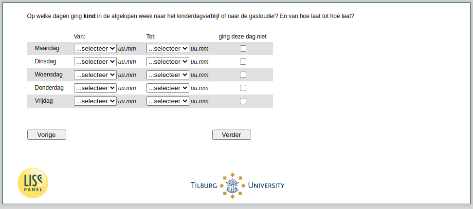

.. _w4e-v2_vokind: 

 
 .. role:: raw-html(raw) 
        :format: html 
 
`v2_vokind` – Times Attendance Kindergarden
======================================================= 

:raw-html:`←` :ref:`w4e-v2_vokind_cat` | :ref:`w4e-v3_vokind` :raw-html:`→` 
 
*Routing to the question depends on answer in:* :ref:`w4e-v0b` 

On what days did the child go to the kindergarden or the childminder in the past week? And from what time to what time?
 
.. csv-table:: 
   :delim: | 
   :header: ,From :, To :, this day did not work
 
           Monday | :raw-html:`<form><input type="text" id="fname" name="fname"> </form>` |:raw-html:`<form><input type="text" id="fname" name="fname"> </form>` |:raw-html:`<form><input type="text" id="fname" name="fname"> </form>` 
           Tuesday | :raw-html:`<form><input type="text" id="fname" name="fname"> </form>` |:raw-html:`<form><input type="text" id="fname" name="fname"> </form>` |:raw-html:`<form><input type="text" id="fname" name="fname"> </form>` 
           Wednesday | :raw-html:`<form><input type="text" id="fname" name="fname"> </form>` |:raw-html:`<form><input type="text" id="fname" name="fname"> </form>` |:raw-html:`<form><input type="text" id="fname" name="fname"> </form>` 
           Thursday | :raw-html:`<form><input type="text" id="fname" name="fname"> </form>` |:raw-html:`<form><input type="text" id="fname" name="fname"> </form>` |:raw-html:`<form><input type="text" id="fname" name="fname"> </form>` 
           Friday | :raw-html:`<form><input type="text" id="fname" name="fname"> </form>` |:raw-html:`<form><input type="text" id="fname" name="fname"> </form>` |:raw-html:`<form><input type="text" id="fname" name="fname"> </form>` 

:raw-html:`&larr;` :ref:`w4e-v2_vokind_cat` | :ref:`w4e-v3_vokind` :raw-html:`&rarr;` 
 
