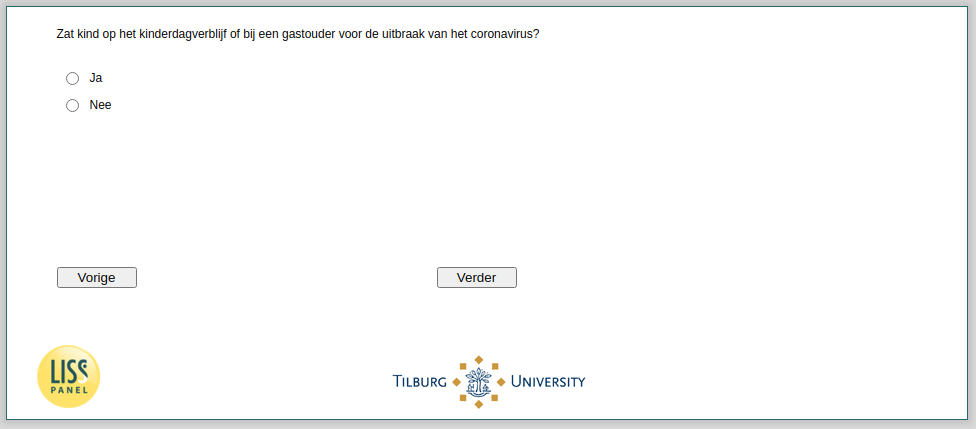

.. _w4e-v2_vokind_cat: 

 
 .. role:: raw-html(raw) 
        :format: html 
 
`v2_vokind_cat` – Attendance Kindergarden
========================================================= 

:raw-html:`&larr;` :ref:`w4e-v5_bokind` | :ref:`w4e-v2_vokind` :raw-html:`&rarr;` 
 
*Routing to the question depends on answer in:* :ref:`w4e-v0b` 

Was the child in a kindergarden or with a childminder before the coronavirus outbreak?
 
.. csv-table:: 
   :delim: | 
   :header: Yes, No
 
           :raw-html:`&#10063;`|:raw-html:`&#10063;` 

:raw-html:`&larr;` :ref:`w4e-v5_bokind` | :ref:`w4e-v2_vokind` :raw-html:`&rarr;` 
 
