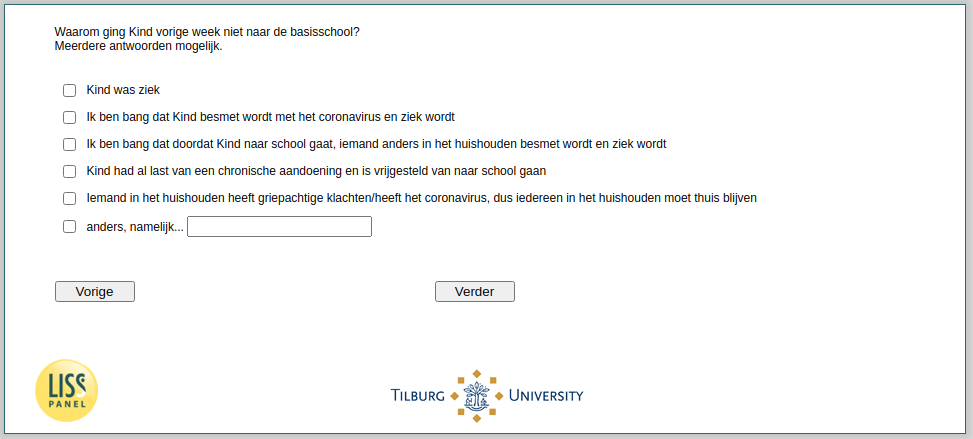

.. _w4e-v3_bokind: 

 
 .. role:: raw-html(raw) 
        :format: html 
 
`v3_bokind` – Reasons No School Attendance
====================================================== 

:raw-html:`&larr;` :ref:`w4e-v2_bokind` | :ref:`w4e-v4_bokind` :raw-html:`&rarr;` 
 
*Routing to the question depends on answer in:* :ref:`w4e-v2_bokind` 

Why didn't child go to primary school last week?
Multiple answers possible.
 
:raw-html:`&#10063;` – Child was sick
 
:raw-html:`&#10063;` – I am afraid that the child will be infected with the coronavirus and become ill
 
:raw-html:`&#10063;` – I am afraid that because the child goes to school, someone else in the household becomes infected and becomes ill
 
:raw-html:`&#10063;` – Child already had a chronic condition and is exempt from going to school
 
:raw-html:`&#10063;` – Someone in the household has flu-like symptoms / has the coronavirus, so everyone in the household should stay at home
 
:raw-html:`&#10063;` – otherwise, namely...
 

:raw-html:`&larr;` :ref:`w4e-v2_bokind` | :ref:`w4e-v4_bokind` :raw-html:`&rarr;` 
 
