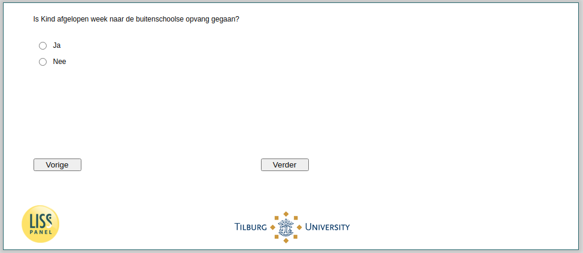

.. _w4e-v4_bokind: 

 
 .. role:: raw-html(raw) 
        :format: html 
 
`v4_bokind` – Attendance Out-of-School Care
======================================================= 

:raw-html:`&larr;` :ref:`w4e-v3_bokind` | :ref:`w4e-v5_bokind` :raw-html:`&rarr;` 
 
*Routing to the question depends on answer in:* :ref:`w4e-v0a` 

Did Child go to out-of-school care last week?
 
.. csv-table:: 
   :delim: | 
   :header: Yes, No
 
           :raw-html:`&#10063;`|:raw-html:`&#10063;` 

:raw-html:`&larr;` :ref:`w4e-v3_bokind` | :ref:`w4e-v5_bokind` :raw-html:`&rarr;` 
 
