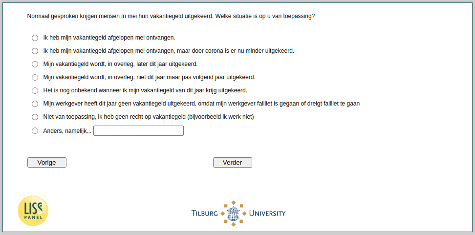

.. _w4e-vakantiegeld1: 

 
 .. role:: raw-html(raw) 
        :format: html 
 
`vakantiegeld1` – Holiday Bonus
=============================================== 

:raw-html:`&larr;` :ref:`w4e-PosJobChar` | :ref:`w4e-vakantiegeld2` :raw-html:`&rarr;` 
 

Normally people receive their holiday pay in May. Which situation applies to you?
 
.. csv-table:: 
   :delim: | 
   :header: I received my holiday pay last May., I received my holiday pay last May, but less has been paid out due to corona., My holiday pay will, in consultation, be paid later this year., My holiday pay will, in consultation, not be this year but only paid next year., It is still unknown when I will receive my holiday allowance for this year., My employer has not paid any holiday allowance this year because my employer has gone bankrupt or is in danger of going bankrupt, Not applicable, I have no entitlement to holiday pay (for example, I do not work), Other, namely…
 
           :raw-html:`&#10063;`|:raw-html:`&#10063;`|:raw-html:`&#10063;`|:raw-html:`&#10063;`|:raw-html:`&#10063;`|:raw-html:`&#10063;`|:raw-html:`&#10063;`|:raw-html:`&#10063;`|:raw-html:`&#10063;`|:raw-html:`&#10063;`|:raw-html:`&#10063;`|:raw-html:`&#10063;`|:raw-html:`&#10063;`|:raw-html:`&#10063;`|:raw-html:`&#10063;`|:raw-html:`&#10063;` 

:raw-html:`&larr;` :ref:`w4e-PosJobChar` | :ref:`w4e-vakantiegeld2` :raw-html:`&rarr;` 
 
