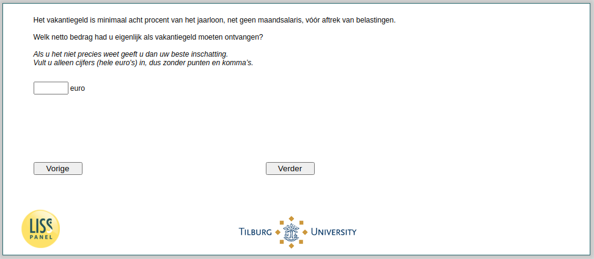

.. _w4e-vakantiegeld2: 

 
 .. role:: raw-html(raw) 
        :format: html 
 
`vakantiegeld2` – Should Receive Holiday Pay
============================================================ 

:raw-html:`←` :ref:`w4e-vakantiegeld1` | :ref:`w4e-vakantiegeld2b` :raw-html:`→` 
 
*Routing to the question depends on answer in:* :ref:`w4e-vakantiegeld1` 

Holiday pay is at least eight percent of the annual salary, as no salary, before taxes. [What net amount you received as holiday? / What net amount you should have received as holiday pay and what amount did you receive? / What net you'd actually like to receive holiday pay?]
If you are not sure please give your best inschatting.Vult only numbers (whole euros), so without full stops and commas. 
 

:raw-html:`←` :ref:`w4e-vakantiegeld1` | :ref:`w4e-vakantiegeld2b` :raw-html:`→` 
 
