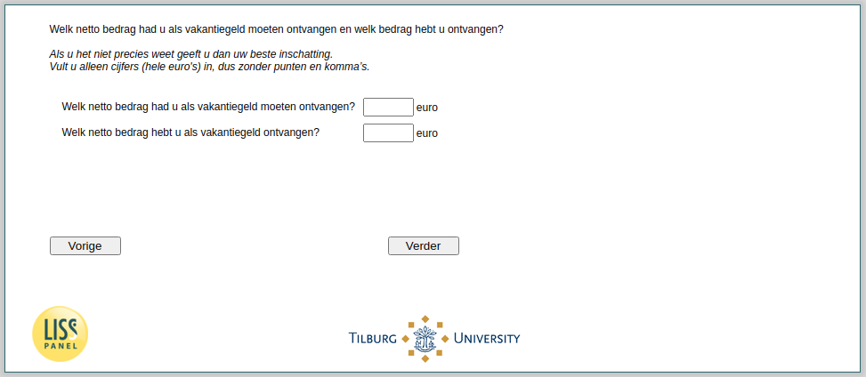

.. _w4e-vakantiegeld2b: 

 
 .. role:: raw-html(raw) 
        :format: html 
 
`vakantiegeld2b` – Received Amount Holiday Pay
=============================================================== 

:raw-html:`&larr;` :ref:`w4e-vakantiegeld2` | :ref:`w4e-vakantiegeld3` :raw-html:`&rarr;` 
 
*Routing to the question depends on answer in:* :ref:`w4e-vakantiegeld1` 

What net amount you should have received as holiday pay and what amount did you receive? If you are not sure please give your best inschatting.Vult only numbers (whole euros), so without full stops and commas.
 
.. csv-table:: 
   :delim: | 
 
           What net amount you should have received as holiday pay? | :raw-html:`<form><input type="text" id="fname" name="fname"> </form>` 
           What net amount you receive as a holiday? | :raw-html:`<form><input type="text" id="fname" name="fname"> </form>` 

:raw-html:`&larr;` :ref:`w4e-vakantiegeld2` | :ref:`w4e-vakantiegeld3` :raw-html:`&rarr;` 
 
