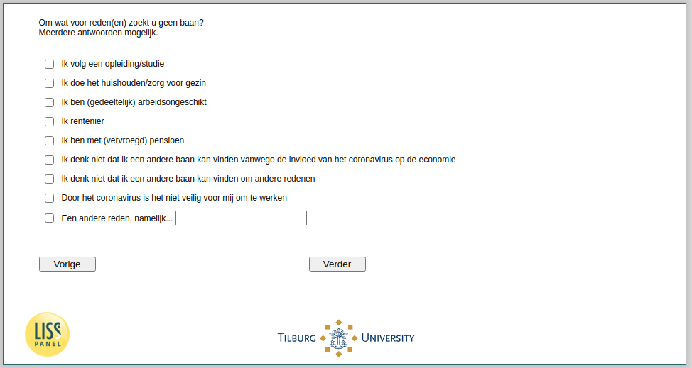

.. _w4e-ws059: 

 
 .. role:: raw-html(raw) 
        :format: html 
 
`ws059` – Reasons No Job Search Among Not (Self-) Employed
================================================================== 

:raw-html:`&larr;` :ref:`w4e-NotLooking` | :ref:`w4e-ws060` :raw-html:`&rarr;` 
 
*Routing to the question depends on answer in:* :ref:`w4e-ws058` 

For what reason (s) are you not looking for a job? Multiple answers possible.
 
:raw-html:`&#10063;` – I follow a training / study
 
:raw-html:`&#10063;` – I do the housework / caring for family
 
:raw-html:`&#10063;` – I (partially) occupationally
 
:raw-html:`&#10063;` – I rentier
 
:raw-html:`&#10063;` – I (early) retirement
 
:raw-html:`&#10063;` – I do not think I can find another job because of the influence of the coronavirus on the economy
 
:raw-html:`&#10063;` – I do not think I can find another job for other reasons
 
:raw-html:`&#10063;` – The coronavirus is not safe for me to work
 
:raw-html:`&#10063;` – Another reason, namely ...
 

:raw-html:`&larr;` :ref:`w4e-NotLooking` | :ref:`w4e-ws060` :raw-html:`&rarr;` 
 
