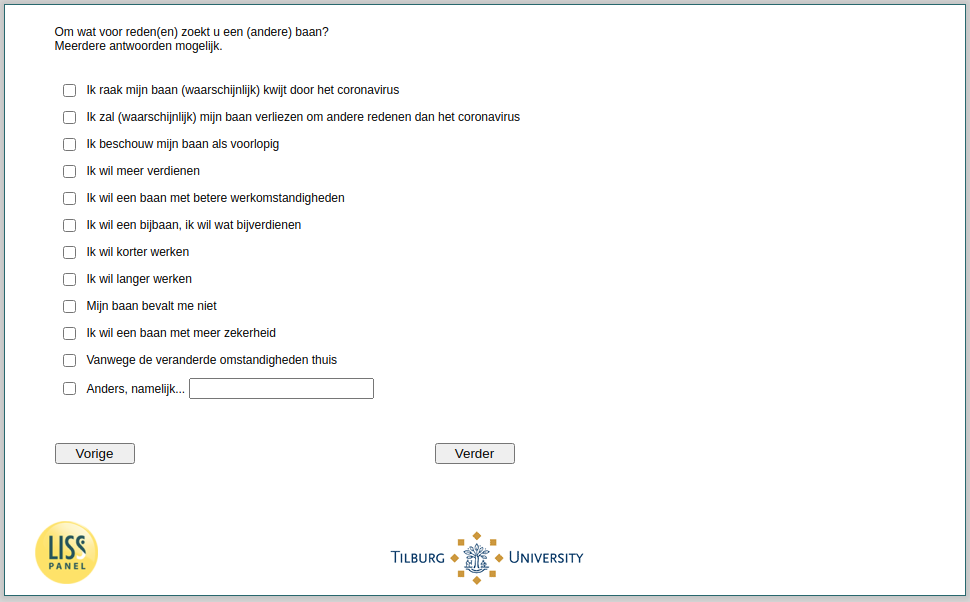

.. _w4e-ws060: 

 
 .. role:: raw-html(raw) 
        :format: html 
 
`ws060` – Reasons Looking for New Job
============================================= 

:raw-html:`&larr;` :ref:`w4e-ws059` | :ref:`w4e-ws063` :raw-html:`&rarr;` 
 
*Routing to the question depends on answer in:* :ref:`w4e-ws058` 

For what reason (s) are you looking for a (different) job? Multiple answers possible.
 
:raw-html:`&#10063;` – I (probably) lose my job because of the corona virus
 
:raw-html:`&#10063;` – I will (probably) lose my job for reasons other than the corona virus
 
:raw-html:`&#10063;` – I consider my job to be temporary
 
:raw-html:`&#10063;` – I want to earn more
 
:raw-html:`&#10063;` – I want a job with better working conditions
 
:raw-html:`&#10063;` – I want a side job, I want to earn some extra money
 
:raw-html:`&#10063;` – I want to work fewer hours
 
:raw-html:`&#10063;` – I want to work longer
 
:raw-html:`&#10063;` – I don't like my job
 
:raw-html:`&#10063;` – I want a job with more certainty
 
:raw-html:`&#10063;` – Because of the changed circumstances at home
 
:raw-html:`&#10063;` – Otherwise, namely...
 

:raw-html:`&larr;` :ref:`w4e-ws059` | :ref:`w4e-ws063` :raw-html:`&rarr;` 
 
