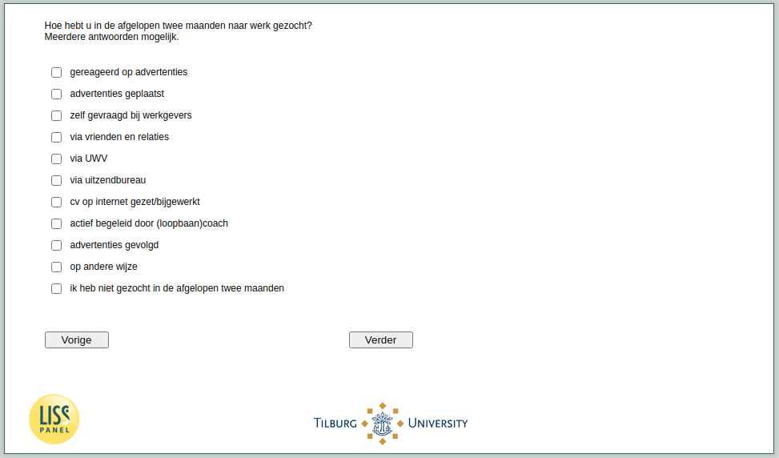

.. _w4e-ws063: 

 
 .. role:: raw-html(raw) 
        :format: html 
 
`ws063` – Job Search Strategy
===================================== 

:raw-html:`&larr;` :ref:`w4e-ws060` | :ref:`w4e-ws064` :raw-html:`&rarr;` 
 
*Routing to the question depends on answer in:* :ref:`w4e-ws058` 

How did you look for work in the past two months? Multiple answers possible.
 
:raw-html:`&#10063;` – responded to ads
 
:raw-html:`&#10063;` – ads
 
:raw-html:`&#10063;` – asked by employers
 
:raw-html:`&#10063;` – through friends and relationships
 
:raw-html:`&#10063;` – via UWV
 
:raw-html:`&#10063;` – through employment agency
 
:raw-html:`&#10063;` – CV put on internet / updated
 
:raw-html:`&#10063;` – actively supported by (career) coach
 
:raw-html:`&#10063;` – followed ads
 
:raw-html:`&#10063;` – otherwise
 
:raw-html:`&#10063;` – I have wanted in the past two months
 

:raw-html:`&larr;` :ref:`w4e-ws060` | :ref:`w4e-ws064` :raw-html:`&rarr;` 
 
