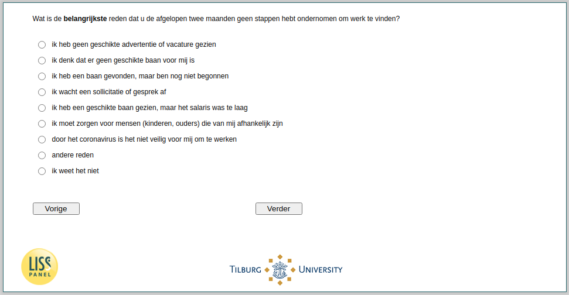

.. _w4e-ws065: 

 
 .. role:: raw-html(raw) 
        :format: html 
 
`ws065` – Reasons for Taking Steps Towards Job Search
============================================================= 

:raw-html:`&larr;` :ref:`w4e-ws064` | :ref:`w4e-JobHours` :raw-html:`&rarr;` 
 
*Routing to the question depends on answer in:* :ref:`w4e-ws063` 

What is the main reason that you have not taken steps to find work in the past two months?
 
.. csv-table:: 
   :delim: | 
   :header: I have not seen a suitable advertisement or vacancy, I think there is no suitable job for me, I have found a job, but I have not yet started, I am waiting for an application or interview, I have seen a suitable job, but the salary was too low, i have to take care of people (children, parents) who depend on me, because of the coronavirus it is not safe for me to work, other reason, i don't know
 
           :raw-html:`&#10063;`|:raw-html:`&#10063;`|:raw-html:`&#10063;`|:raw-html:`&#10063;`|:raw-html:`&#10063;`|:raw-html:`&#10063;`|:raw-html:`&#10063;`|:raw-html:`&#10063;`|:raw-html:`&#10063;`|:raw-html:`&#10063;`|:raw-html:`&#10063;`|:raw-html:`&#10063;` 

:raw-html:`&larr;` :ref:`w4e-ws064` | :ref:`w4e-JobHours` :raw-html:`&rarr;` 
 
