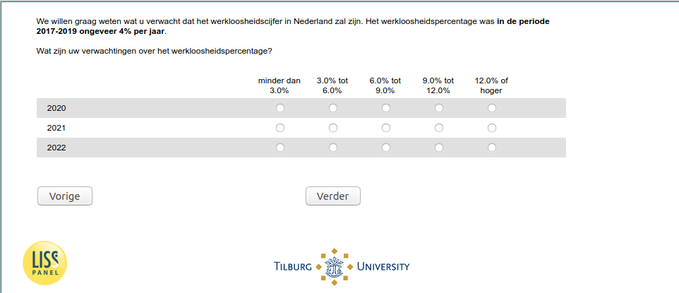

.. _w5d-ExpUnempl_today: 

 
 .. role:: raw-html(raw) 
        :format: html 
 
`ExpUnempl_today` – Expected Unemployment Today
================================================================= 

:raw-html:`&larr;` :ref:`w5d-expectedincome` | :ref:`w5d-ExpEcGr_today` :raw-html:`&rarr;` 
 

We willen graag weten wat u verwacht dat het werkloosheidscijfer in Nederland zal zijn. Het werkloosheidspercentage was in de periode 2017-2019 ongeveer 4% per jaar. 
Wat zijn uw verwachtingen over het werkloosheidspercentage?
 
.. csv-table:: 
   :delim: | 
   :header: ,minder dan 3.0%|3.0% tot 6.0%|6.0% tot 9.0%|9.0% tot 12.0%|12.0% of hoger
 
           2020 | :raw-html:`&#10063;`|:raw-html:`&#10063;`|:raw-html:`&#10063;`|:raw-html:`&#10063;`|:raw-html:`&#10063;` 
           2021 | :raw-html:`&#10063;`|:raw-html:`&#10063;`|:raw-html:`&#10063;`|:raw-html:`&#10063;`|:raw-html:`&#10063;` 
           2022 | :raw-html:`&#10063;`|:raw-html:`&#10063;`|:raw-html:`&#10063;`|:raw-html:`&#10063;`|:raw-html:`&#10063;` 

:raw-html:`&larr;` :ref:`w5d-expectedincome` | :ref:`w5d-ExpEcGr_today` :raw-html:`&rarr;` 
 
