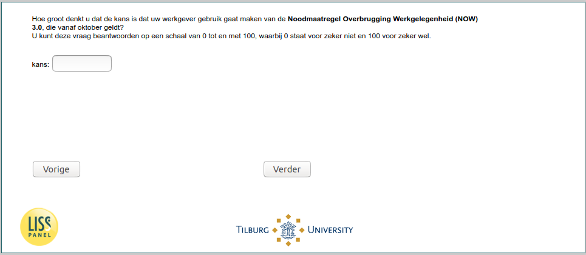

.. _w5d-NOW_ES1: 

 
 .. role:: raw-html(raw) 
        :format: html 
 
`NOW_ES1` – NOW 3.0 expectations
========================================== 

:raw-html:`&larr;` :ref:`w5d-q17d` | :ref:`w5d-NOW_ES2` :raw-html:`&rarr;` 
 
*Routing to the question depends on answer in:* :ref:`w5d-EmploymentStatus` 

Hoe groot denkt u dat de kans is dat uw werkgever gebruik gaat maken van de Noodmaatregel Overbrugging Werkgelegenheid (NOW) 3.0, die vanaf oktober geldt? 
U kunt deze vraag beantwoorden op een schaal van 0 tot en met 100, waarbij 0 staat voor zeker niet en 100 voor zeker wel.
 
.. csv-table:: 
   :delim: | 
 
           nan | :raw-html:`<form><input type="text" id="fname" name="fname"> </form>` 

:raw-html:`&larr;` :ref:`w5d-q17d` | :ref:`w5d-NOW_ES2` :raw-html:`&rarr;` 
 
