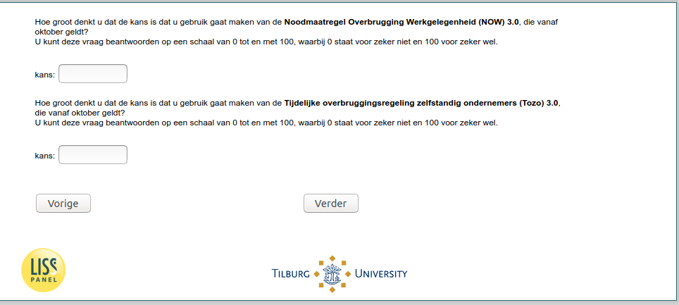

.. _w5d-NOW_ES2: 

 
 .. role:: raw-html(raw) 
        :format: html 
 
`NOW_ES2` – NOW 3.0 expectations among Self-Employed
============================================================== 

:raw-html:`←` :ref:`w5d-NOW_ES1` | :ref:`w5d-change_empl` :raw-html:`→` 
 
*Routing to the question depends on answer in:* :ref:`w5d-EmploymentStatus` 

nan
 
.. csv-table:: 
   :delim: | 
 
           Hoe groot denkt u dat de kans is dat u gebruik gaat maken van de Noodmaatregel Overbrugging Werkgelegenheid (NOW) 3.0, die vanaf oktober geldt?
U kunt deze vraag beantwoorden op een schaal van 0 tot en met 100, waarbij 0 staat voor zeker niet en 100 voor zeker wel. | :raw-html:`<form><input type="text" id="fname" name="fname"> </form>` 
           Hoe groot denkt u dat de kans is dat u gebruik gaat maken van de Tijdelijke overbruggingsregeling zelfstandig ondernemers (Tozo) 3.0, die vanaf oktober geldt?
U kunt deze vraag beantwoorden op een schaal van 0 tot en met 100, waarbij 0 staat voor zeker niet en 100 voor zeker wel. | :raw-html:`<form><input type="text" id="fname" name="fname"> </form>` 

:raw-html:`&larr;` :ref:`w5d-NOW_ES1` | :ref:`w5d-change_empl` :raw-html:`&rarr;` 
 
