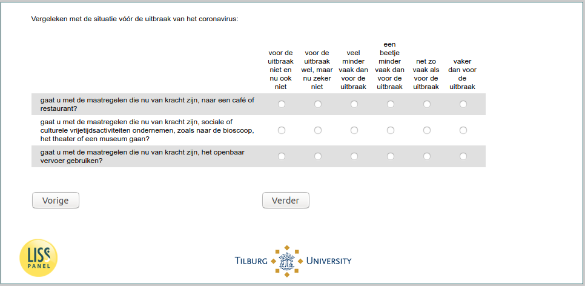

.. _w5d-avoid: 

 
 .. role:: raw-html(raw) 
        :format: html 
 
`avoid` – Avoid Activities
================================== 

:raw-html:`&larr;` :ref:`w5d-support` | :ref:`w5d-EmploymentStatus` :raw-html:`&rarr;` 
 

Vergeleken met de situatie vóór de uitbraak van het coronavirus:
 
.. csv-table:: 
   :delim: | 
   :header: ,voor de uitbraak niet en nu ook niet|voor de uitbraak wel, maar nu zeker niet|veel minder vaak dan voor de uitbraak|een beetje minder vaak dan voor de uitbraak|net zo vaak als voor de uitbraak|vaker dan voor de uitbraak
 
           gaat u met de maatregelen die nu van kracht zijn, naar een café of restaurant? | :raw-html:`&#10063;`|:raw-html:`&#10063;`|:raw-html:`&#10063;`|:raw-html:`&#10063;`|:raw-html:`&#10063;`|:raw-html:`&#10063;` 
           gaat u met de maatregelen die nu van kracht zijn, sociale of culturele vrijetijdsactiviteiten ondernemen, zoals naar de bioscoop, het theater of een museum gaan? | :raw-html:`&#10063;`|:raw-html:`&#10063;`|:raw-html:`&#10063;`|:raw-html:`&#10063;`|:raw-html:`&#10063;`|:raw-html:`&#10063;` 
           gaat u met de maatregelen die nu van kracht zijn, het openbaar vervoer gebruiken? | :raw-html:`&#10063;`|:raw-html:`&#10063;`|:raw-html:`&#10063;`|:raw-html:`&#10063;`|:raw-html:`&#10063;`|:raw-html:`&#10063;` 

:raw-html:`&larr;` :ref:`w5d-support` | :ref:`w5d-EmploymentStatus` :raw-html:`&rarr;` 
 
.. _w5d-avoid: 

 
 .. role:: raw-html(raw) 
        :format: html 
 
`avoid` – Avoid Activities
================================== 

:raw-html:`&larr;` :ref:`w5d-support` | :ref:`w5d-EmploymentStatus` :raw-html:`&rarr;` 
 

Vergeleken met de situatie vóór de uitbraak van het coronavirus:
 
.. csv-table:: 
   :delim: | 
   :header: ,voor de uitbraak niet en nu ook niet|voor de uitbraak wel, maar nu zeker niet|veel minder vaak dan voor de uitbraak|een beetje minder vaak dan voor de uitbraak|net zo vaak als voor de uitbraak|vaker dan voor de uitbraak
 
           gaat u met de maatregelen die nu van kracht zijn, naar een café of restaurant? | :raw-html:`&#10063;`|:raw-html:`&#10063;`|:raw-html:`&#10063;`|:raw-html:`&#10063;`|:raw-html:`&#10063;`|:raw-html:`&#10063;` 
           gaat u met de maatregelen die nu van kracht zijn, sociale of culturele vrijetijdsactiviteiten ondernemen, zoals naar de bioscoop, het theater of een museum gaan? | :raw-html:`&#10063;`|:raw-html:`&#10063;`|:raw-html:`&#10063;`|:raw-html:`&#10063;`|:raw-html:`&#10063;`|:raw-html:`&#10063;` 
           gaat u met de maatregelen die nu van kracht zijn, het openbaar vervoer gebruiken? | :raw-html:`&#10063;`|:raw-html:`&#10063;`|:raw-html:`&#10063;`|:raw-html:`&#10063;`|:raw-html:`&#10063;`|:raw-html:`&#10063;` 

:raw-html:`&larr;` :ref:`w5d-support` | :ref:`w5d-EmploymentStatus` :raw-html:`&rarr;` 
 
.. _w5d-avoid: 

 
 .. role:: raw-html(raw) 
        :format: html 
 
`avoid` – Avoid Activities
================================== 

:raw-html:`&larr;` :ref:`w5d-support` | :ref:`w5d-EmploymentStatus` :raw-html:`&rarr;` 
 

Vergeleken met de situatie vóór de uitbraak van het coronavirus:
 
.. csv-table:: 
   :delim: | 
   :header: ,voor de uitbraak niet en nu ook niet|voor de uitbraak wel, maar nu zeker niet|veel minder vaak dan voor de uitbraak|een beetje minder vaak dan voor de uitbraak|net zo vaak als voor de uitbraak|vaker dan voor de uitbraak
 
           gaat u met de maatregelen die nu van kracht zijn, naar een café of restaurant? | :raw-html:`&#10063;`|:raw-html:`&#10063;`|:raw-html:`&#10063;`|:raw-html:`&#10063;`|:raw-html:`&#10063;`|:raw-html:`&#10063;` 
           gaat u met de maatregelen die nu van kracht zijn, sociale of culturele vrijetijdsactiviteiten ondernemen, zoals naar de bioscoop, het theater of een museum gaan? | :raw-html:`&#10063;`|:raw-html:`&#10063;`|:raw-html:`&#10063;`|:raw-html:`&#10063;`|:raw-html:`&#10063;`|:raw-html:`&#10063;` 
           gaat u met de maatregelen die nu van kracht zijn, het openbaar vervoer gebruiken? | :raw-html:`&#10063;`|:raw-html:`&#10063;`|:raw-html:`&#10063;`|:raw-html:`&#10063;`|:raw-html:`&#10063;`|:raw-html:`&#10063;` 

:raw-html:`&larr;` :ref:`w5d-support` | :ref:`w5d-EmploymentStatus` :raw-html:`&rarr;` 
 
