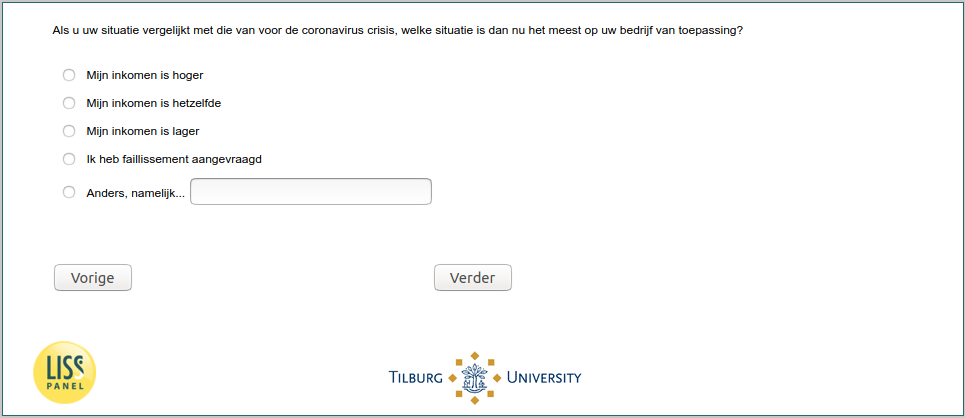

.. _w5d-change_selfempl: 

 
 .. role:: raw-html(raw) 
        :format: html 
 
`change_selfempl` – Income Situation (Self-Employed)
====================================================================== 

:raw-html:`&larr;` :ref:`w5d-change_empl` | :ref:`w5d-change_unempl` :raw-html:`&rarr;` 
 
*Routing to the question depends on answer in:* :ref:`w5d-EmploymentStatus` 

Als u uw situatie vergelijkt met die van voor de coronavirus crisis, welke situatie is dan nu het meest op uw bedrijf van toepassing?
 
:raw-html:`&#10063;` – Mijn inkomen is hoger
 
:raw-html:`&#10063;` – Mijn inkomen is hetzelfde
 
:raw-html:`&#10063;` – Mijn inkomen is lager
 
:raw-html:`&#10063;` – Ik heb faillissement aangevraagd
 
:raw-html:`&#10063;` – Anders, namelijk...
 

:raw-html:`&larr;` :ref:`w5d-change_empl` | :ref:`w5d-change_unempl` :raw-html:`&rarr;` 
 
