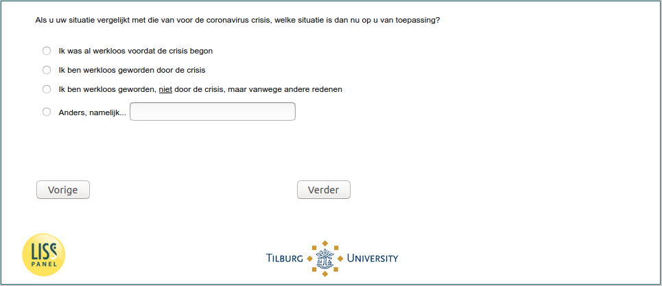

.. _w5d-change_unempl: 

 
 .. role:: raw-html(raw) 
        :format: html 
 
`change_unempl` – Income Situation (Unemployed)
=============================================================== 

:raw-html:`&larr;` :ref:`w5d-change_selfempl` | :ref:`w5d-job_before` :raw-html:`&rarr;` 
 
*Routing to the question depends on answer in:* :ref:`w5d-EmploymentStatus` 

Als u uw situatie vergelijkt met die van voor de coronavirus crisis, welke situatie is dan nu op u van toepassing?
 
:raw-html:`&#10063;` – Ik was al werkloos voordat de crisis begon
 
:raw-html:`&#10063;` – Ik ben werkloos geworden door de crisis
 
:raw-html:`&#10063;` – Ik ben werkloos geworden, niet door de crisis, maar vanwege andere redenen
 
:raw-html:`&#10063;` – Anders, namelijk…
 

:raw-html:`&larr;` :ref:`w5d-change_selfempl` | :ref:`w5d-job_before` :raw-html:`&rarr;` 
 
