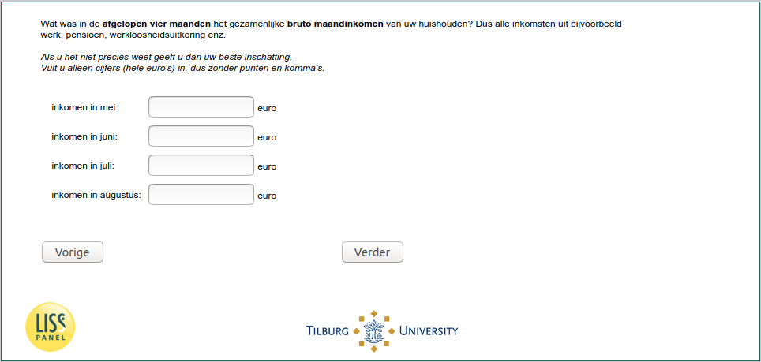

.. _w5d-income: 

 
 .. role:: raw-html(raw) 
        :format: html 
 
`income` – Income
========================== 

:raw-html:`&larr;` :ref:`w5d-q27header_ex_1` | :ref:`w5d-expectedincome` :raw-html:`&rarr;` 
 

Wat was in de afgelopen vier maanden [if (p_aantalhh = 1): uw bruto maandinkomen/ if (p_aantalhh ≠ 1): het gezamenlijke bruto maandinkomen van uw huishouden]? Dus alle inkomsten uit bijvoorbeeld werk, pensioen, werkloosheidsuitkering enz.
 Als u het niet precies weet geeft u dan uw beste inschatting. Vult u alleen cijfers (hele euro's) in, dus zonder punten en komma’s.
 
.. csv-table:: 
   :delim: | 
 
           inkomen in mei: | :raw-html:`<form><input type="text" id="fname" name="fname"> </form>` 
           inkomen in juni: | :raw-html:`<form><input type="text" id="fname" name="fname"> </form>` 
           inkomen in juli: | :raw-html:`<form><input type="text" id="fname" name="fname"> </form>` 
           inkomen in augustus: | :raw-html:`<form><input type="text" id="fname" name="fname"> </form>` 

:raw-html:`&larr;` :ref:`w5d-q27header_ex_1` | :ref:`w5d-expectedincome` :raw-html:`&rarr;` 
 
