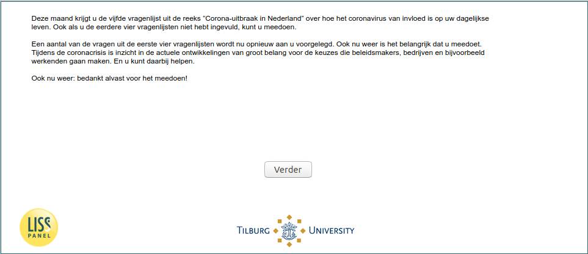

.. _w5d-intro: 

 
 .. role:: raw-html(raw) 
        :format: html 
 
`intro` – Introduction
============================== 

:ref:`w5d-InfectionDiagnosed` :raw-html:`&rarr;` 
 

Deze maand krijgt u de vijfde vragenlijst uit de reeks “Corona-uitbraak in Nederland” over hoe het coronavirus van invloed is op uw dagelijkse leven. Ook als u de eerdere vier vragenlijsten niet hebt ingevuld, kunt u meedoen.

Een aantal van de vragen uit de eerste vier vragenlijsten wordt nu opnieuw aan u voorgelegd. Ook nu weer is het belangrijk dat u meedoet. Tijdens de coronacrisis is inzicht in de actuele ontwikkelingen van groot belang voor de keuzes die beleidsmakers, bedrijven en bijvoorbeeld werkenden gaan maken. En u kunt daarbij helpen.

Ook nu weer: bedankt alvast voor het meedoen! 
 

:ref:`w5d-InfectionDiagnosed` :raw-html:`&rarr;` 
 
.. _w5d-intro: 

 
 .. role:: raw-html(raw) 
        :format: html 
 
`intro` – Introduction
============================== 

:ref:`w5d-InfectionDiagnosed` :raw-html:`&rarr;` 
 

Deze maand krijgt u de vijfde vragenlijst uit de reeks “Corona-uitbraak in Nederland” over hoe het coronavirus van invloed is op uw dagelijkse leven. Ook als u de eerdere vier vragenlijsten niet hebt ingevuld, kunt u meedoen.

Een aantal van de vragen uit de eerste vier vragenlijsten wordt nu opnieuw aan u voorgelegd. Ook nu weer is het belangrijk dat u meedoet. Tijdens de coronacrisis is inzicht in de actuele ontwikkelingen van groot belang voor de keuzes die beleidsmakers, bedrijven en bijvoorbeeld werkenden gaan maken. En u kunt daarbij helpen.

Ook nu weer: bedankt alvast voor het meedoen! 
 

:ref:`w5d-InfectionDiagnosed` :raw-html:`&rarr;` 
 
.. _w5d-intro: 

 
 .. role:: raw-html(raw) 
        :format: html 
 
`intro` – Introduction
============================== 

:ref:`w5d-InfectionDiagnosed` :raw-html:`&rarr;` 
 

Deze maand krijgt u de vijfde vragenlijst uit de reeks “Corona-uitbraak in Nederland” over hoe het coronavirus van invloed is op uw dagelijkse leven. Ook als u de eerdere vier vragenlijsten niet hebt ingevuld, kunt u meedoen.

Een aantal van de vragen uit de eerste vier vragenlijsten wordt nu opnieuw aan u voorgelegd. Ook nu weer is het belangrijk dat u meedoet. Tijdens de coronacrisis is inzicht in de actuele ontwikkelingen van groot belang voor de keuzes die beleidsmakers, bedrijven en bijvoorbeeld werkenden gaan maken. En u kunt daarbij helpen.

Ook nu weer: bedankt alvast voor het meedoen! 
 

:ref:`w5d-InfectionDiagnosed` :raw-html:`&rarr;` 
 
