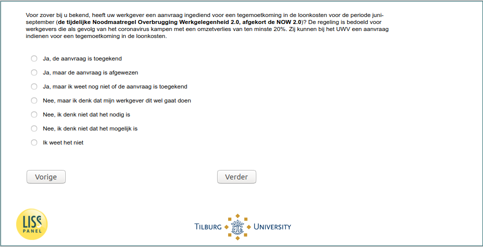

.. _w5d-q16a: 

 
 .. role:: raw-html(raw) 
        :format: html 
 
`q16a` – NOW
=================== 

:raw-html:`←` :ref:`w5d-vacsick` | :ref:`w5d-q17a` :raw-html:`→` 
 
*Routing to the question depends on answer in:* :ref:`w5d-EmploymentStatus` 

Voor zover bij u bekend, heeft uw werkgever een aanvraag ingediend voor een tegemoetkoming in de loonkosten voor de periode juni-september (de tijdelijke Noodmaatregel Overbrugging Werkgelegenheid 2.0, afgekort de NOW 2.0)? De regeling is bedoeld voor werkgevers die als gevolg van het coronavirus kampen met een omzetverlies van ten minste 20%. Zij kunnen bij het UWV een aanvraag indienen voor een tegemoetkoming in de loonkosten.
 
.. csv-table:: 
   :delim: | 
   :header: Ja de aanvraag is toegekend,Ja maar de aanvraag is afgewezen,Ja maar ik weet nog niet of de aanvraag is toegekend,Nee maar ik denk dat mijn werkgever dit wel gaat doen,Nee ik denk niet dat het nodig is,Nee ik denk niet dat het mogelijk is,Ik weet het niet
 
           :raw-html:`❏`|:raw-html:`❏`|:raw-html:`❏`|:raw-html:`❏`|:raw-html:`❏`|:raw-html:`❏`|:raw-html:`❏` 

:raw-html:`←` :ref:`w5d-vacsick` | :ref:`w5d-q17a` :raw-html:`→` 
 
