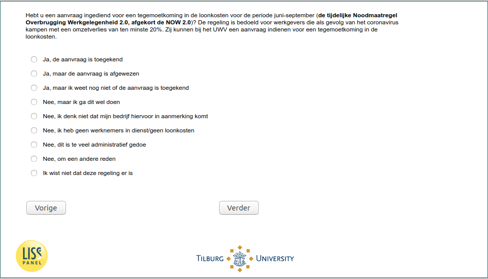

.. _w5d-q17a: 

 
 .. role:: raw-html(raw) 
        :format: html 
 
`q17a` – NOW among Self-Employed
======================================= 

:raw-html:`&larr;` :ref:`w5d-q16a` | :ref:`w5d-q17d` :raw-html:`&rarr;` 
 
*Routing to the question depends on answer in:* :ref:`w5d-EmploymentStatus` 

Hebt u een aanvraag ingediend voor een tegemoetkoming in de loonkosten voor de periode juni-september (de tijdelijke Noodmaatregel Overbrugging Werkgelegenheid 2.0, afgekort de NOW 2.0)? De regeling is bedoeld voor werkgevers die als gevolg van het coronavirus kampen met een omzetverlies van ten minste 20%. Zij kunnen bij het UWV een aanvraag indienen voor een tegemoetkoming in de loonkosten.
 
.. csv-table:: 
   :delim: | 
   :header: Ja de aanvraag is toegekend,Ja maar de aanvraag is afgewezen,Ja maar ik weet nog niet of de aanvraag is toegekend,Nee maar ik ga dit wel doen,Nee ik denk niet dat mijn bedrijf hiervoor in aanmerking komt,Nee ik heb geen werknemers in dienst/geen loonkosten,Nee dit is te veel administratief gedoe,Nee om een andere reden,Ik wist niet dat deze regeling er is
 
           :raw-html:`&#10063;`|:raw-html:`&#10063;`|:raw-html:`&#10063;`|:raw-html:`&#10063;`|:raw-html:`&#10063;`|:raw-html:`&#10063;`|:raw-html:`&#10063;`|:raw-html:`&#10063;`|:raw-html:`&#10063;` 

:raw-html:`&larr;` :ref:`w5d-q16a` | :ref:`w5d-q17d` :raw-html:`&rarr;` 
 
