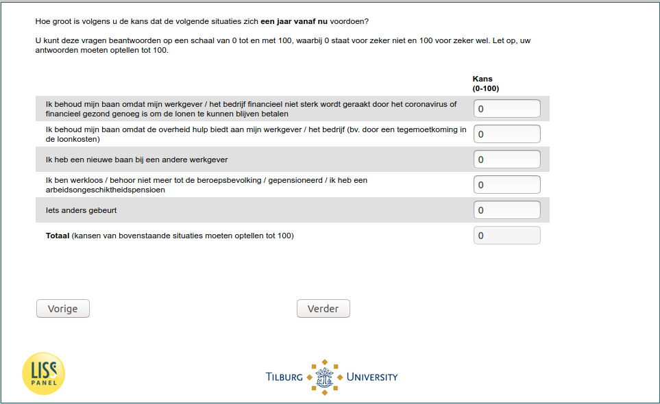

.. _w5d-q26header_1: 

 
 .. role:: raw-html(raw) 
        :format: html 
 
`q26header_1` – Expectations Next Year among Employed
=================================================================== 

:raw-html:`←` :ref:`w5d-q26` | :ref:`w5d-q27header` :raw-html:`→` 
 
*Routing to the question depends on answer in:* :ref:`w5d-EmploymentStatus` 

Hoe groot is volgens u de kans dat de volgende situaties zich een jaar vanaf nu voordoen?
U kunt deze vragen beantwoorden op een schaal van 0 tot en met 100, waarbij 0 staat voor zeker niet en 100 voor zeker wel. Let op, uw antwoorden moeten optellen tot 100.
 
.. csv-table:: 
   :delim: | 
 
           Ik behoud mijn baan omdat mijn werkgever / het bedrijf financieel niet sterk wordt geraakt door het coronavirus of financieel gezond genoeg is om de lonen te kunnen blijven betalen | :raw-html:`<form><input type="text" id="fname" name="fname"> </form>` 
           Ik behoud mijn baan omdat de overheid hulp biedt aan mijn werkgever / het bedrijf (bv. door een tegemoetkoming in de loonkosten) | :raw-html:`<form><input type="text" id="fname" name="fname"> </form>` 
           Ik heb een nieuwe baan bij een andere werkgever | :raw-html:`<form><input type="text" id="fname" name="fname"> </form>` 
           Ik ben werkloos / behoor niet meer tot de beroepsbevolking / gepensioneerd / ik heb een arbeidsongeschiktheidspensioen | :raw-html:`<form><input type="text" id="fname" name="fname"> </form>` 
           Iets anders gebeurt | :raw-html:`<form><input type="text" id="fname" name="fname"> </form>` 

:raw-html:`&larr;` :ref:`w5d-q26` | :ref:`w5d-q27header` :raw-html:`&rarr;` 
 
