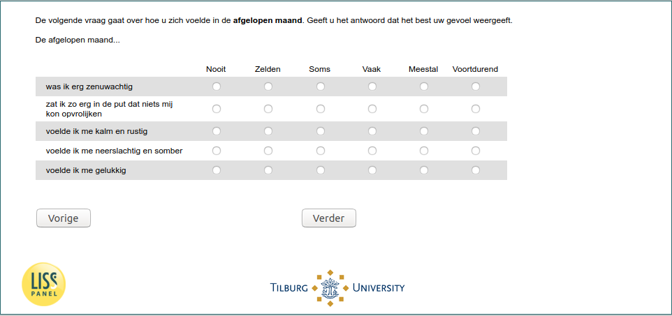

.. _w5d-q30hd_maand: 

 
 .. role:: raw-html(raw) 
        :format: html 
 
`q30hd_maand` – Mental Health in the Past Month
============================================================= 

:raw-html:`&larr;` :ref:`w5d-q1header` | :ref:`w5d-support` :raw-html:`&rarr;` 
 

De volgende vraag gaat over hoe u zich voelde in de afgelopen maand. Geeft u het antwoord dat het best uw gevoel weergeeft. 
De afgelopen maand..
 
.. csv-table:: 
   :delim: | 
   :header: ,Nooit,Zelden,Soms,Vaak,Meestal,Voortdurend
 
           was ik erg zenuwachtig | :raw-html:`&#10063;`|:raw-html:`&#10063;`|:raw-html:`&#10063;`|:raw-html:`&#10063;`|:raw-html:`&#10063;`|:raw-html:`&#10063;` 
           zat ik zo erg in de put dat niets mij kon opvrolijken | :raw-html:`&#10063;`|:raw-html:`&#10063;`|:raw-html:`&#10063;`|:raw-html:`&#10063;`|:raw-html:`&#10063;`|:raw-html:`&#10063;` 
           voelde ik me kalm en rustig | :raw-html:`&#10063;`|:raw-html:`&#10063;`|:raw-html:`&#10063;`|:raw-html:`&#10063;`|:raw-html:`&#10063;`|:raw-html:`&#10063;` 
           voelde ik me neerslachtig en somber | :raw-html:`&#10063;`|:raw-html:`&#10063;`|:raw-html:`&#10063;`|:raw-html:`&#10063;`|:raw-html:`&#10063;`|:raw-html:`&#10063;` 
           voelde ik me gelukkig | :raw-html:`&#10063;`|:raw-html:`&#10063;`|:raw-html:`&#10063;`|:raw-html:`&#10063;`|:raw-html:`&#10063;`|:raw-html:`&#10063;` 

:raw-html:`&larr;` :ref:`w5d-q1header` | :ref:`w5d-support` :raw-html:`&rarr;` 
 
