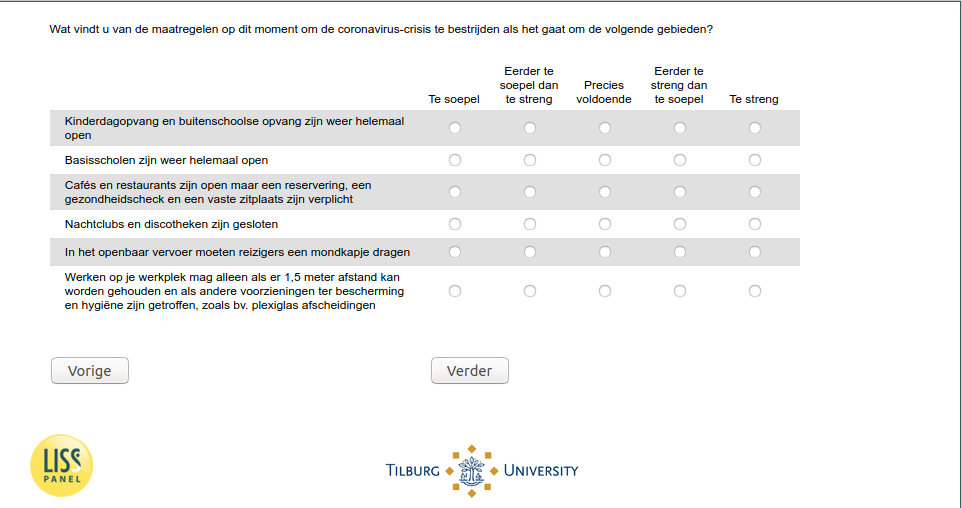

.. _w5d-support: 

 
 .. role:: raw-html(raw) 
        :format: html 
 
`support` – Support Government Policy
=============================================== 

:raw-html:`&larr;` :ref:`w5d-q30hd_maand` | :ref:`w5d-avoid` :raw-html:`&rarr;` 
 

Wat vindt u van de maatregelen op dit moment om de coronavirus-crisis te bestrijden als het gaat om de volgende gebieden?
 
.. csv-table:: 
   :delim: | 
   :header: ,Te soepel,Eerder te soepel dan te streng,Precies voldoende,Eerder te streng dan te soepel,Te streng
 
           Kinderdagopvang en buitenschoolse opvang zijn weer helemaal open | :raw-html:`&#10063;`|:raw-html:`&#10063;`|:raw-html:`&#10063;`|:raw-html:`&#10063;`|:raw-html:`&#10063;` 
           Basisscholen zijn weer helemaal open | :raw-html:`&#10063;`|:raw-html:`&#10063;`|:raw-html:`&#10063;`|:raw-html:`&#10063;`|:raw-html:`&#10063;` 
           Cafés en restaurants zijn open maar een reservering, een gezondheidscheck en een vaste zitplaats zijn verplicht | :raw-html:`&#10063;`|:raw-html:`&#10063;`|:raw-html:`&#10063;`|:raw-html:`&#10063;`|:raw-html:`&#10063;` 
           Nachtclubs en discotheken zijn gesloten | :raw-html:`&#10063;`|:raw-html:`&#10063;`|:raw-html:`&#10063;`|:raw-html:`&#10063;`|:raw-html:`&#10063;` 
           In het openbaar vervoer moeten reizigers een mondkapje dragen | :raw-html:`&#10063;`|:raw-html:`&#10063;`|:raw-html:`&#10063;`|:raw-html:`&#10063;`|:raw-html:`&#10063;` 
           Werken op je werkplek mag alleen als er 1,5 meter afstand kan worden gehouden en als andere voorzieningen ter bescherming en hygiëne zijn getroffen, zoals bv. plexiglas afscheidingen | :raw-html:`&#10063;`|:raw-html:`&#10063;`|:raw-html:`&#10063;`|:raw-html:`&#10063;`|:raw-html:`&#10063;` 

:raw-html:`&larr;` :ref:`w5d-q30hd_maand` | :ref:`w5d-avoid` :raw-html:`&rarr;` 
 
