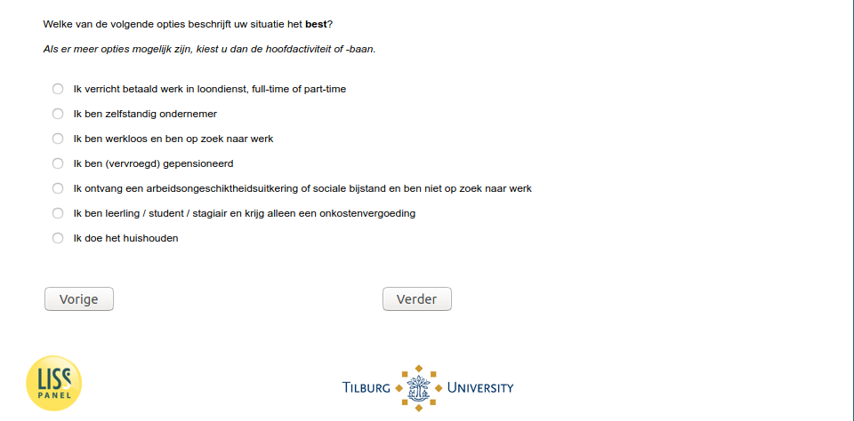

.. _w5e-EmploymentStatus: 

 
 .. role:: raw-html(raw) 
        :format: html 
 
`EmploymentStatus` – Employment Status
========================================================= 

:raw-html:`&larr;` :ref:`w5e-avoid` | :ref:`w5e-q14` :raw-html:`&rarr;` 
 

Which of the following options best describes your situation? 
If more options are possible, please choose the main activity or job
 
.. csv-table:: 
   :delim: | 
   :header: employed|self-employed|unemployed|retired|social assistance|student or trainee|homemaker
 
           :raw-html:`&#10063;`|:raw-html:`&#10063;`|:raw-html:`&#10063;`|:raw-html:`&#10063;`|:raw-html:`&#10063;`|:raw-html:`&#10063;`|:raw-html:`&#10063;` 

:raw-html:`&larr;` :ref:`w5e-avoid` | :ref:`w5e-q14` :raw-html:`&rarr;` 
 
