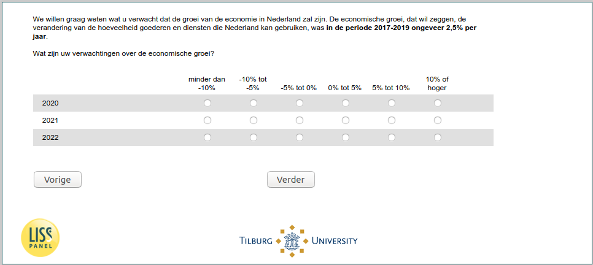

.. _w5e-ExpEcGr_today: 

 
 .. role:: raw-html(raw) 
        :format: html 
 
`ExpEcGr_today` – Expected Economic Growth Today
================================================================ 

:raw-html:`←` :ref:`w5e-ExpUnempl_today` | :ref:`w5e-ExpInfl_today` :raw-html:`→` 
 

We would like to know what you expect the growth of the economy in the Netherlands will be. Economic growth, i.e. the change in the amount of goods and services that the Netherlands can use, was about 2.5% per year in the period 2017-2019. 
What are your expectations of economic growth?
 
.. csv-table:: 
   :delim: | 
   :header: ,less than -10%,-10% to -5%,-5% to 0%,0% to 5%,5% to 10%,10% or greater
 
           2020 | :raw-html:`❏`|:raw-html:`❏`|:raw-html:`❏`|:raw-html:`❏`|:raw-html:`❏`|:raw-html:`❏` 
           2021 | :raw-html:`❏`|:raw-html:`❏`|:raw-html:`❏`|:raw-html:`❏`|:raw-html:`❏`|:raw-html:`❏` 
           2022 | :raw-html:`❏`|:raw-html:`❏`|:raw-html:`❏`|:raw-html:`❏`|:raw-html:`❏`|:raw-html:`❏` 

:raw-html:`←` :ref:`w5e-ExpUnempl_today` | :ref:`w5e-ExpInfl_today` :raw-html:`→` 
 
