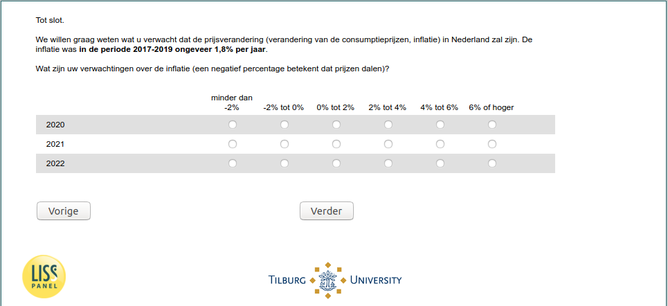

.. _w5e-ExpInfl_today: 

 
 .. role:: raw-html(raw) 
        :format: html 
 
`ExpInfl_today` – Expected Inflation Today
========================================================== 

:raw-html:`&larr;` :ref:`w5e-ExpEcGr_today` 
 
*Routing to the question depends on answer in:* :ref:`w5e-nan` 

We would like to know what you expect the price change (change in consumer prices, inflation) to be in the Netherlands. Inflation in the period 2017-2019 was about 1.8% per year.
What are your expectations about inflation (a negative percentage means that prices are falling)?
 
.. csv-table:: 
   :delim: | 
   :header: ,less than -2%|-2% to 0%|0% to 2%|2% to 4%|4% to 6%|6% or greater
 
           2020 | :raw-html:`&#10063;`|:raw-html:`&#10063;`|:raw-html:`&#10063;`|:raw-html:`&#10063;`|:raw-html:`&#10063;`|:raw-html:`&#10063;` 
           2021 | :raw-html:`&#10063;`|:raw-html:`&#10063;`|:raw-html:`&#10063;`|:raw-html:`&#10063;`|:raw-html:`&#10063;`|:raw-html:`&#10063;` 
           2022 | :raw-html:`&#10063;`|:raw-html:`&#10063;`|:raw-html:`&#10063;`|:raw-html:`&#10063;`|:raw-html:`&#10063;`|:raw-html:`&#10063;` 

:raw-html:`&larr;` :ref:`w5e-ExpEcGr_today` 
 
