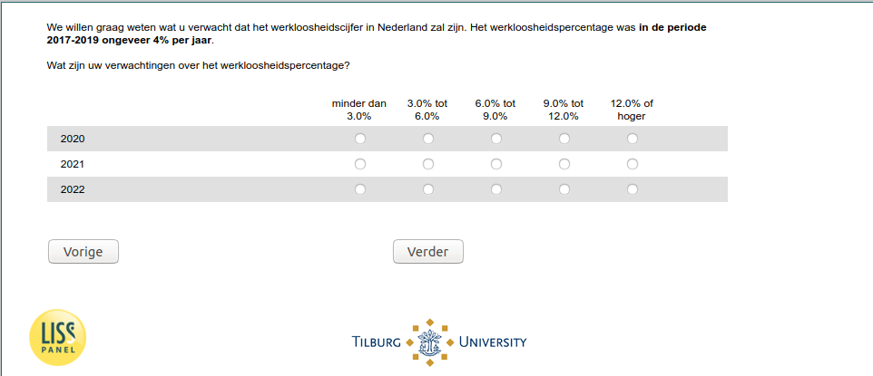

.. _w5e-ExpUnempl_today: 

 
 .. role:: raw-html(raw) 
        :format: html 
 
`ExpUnempl_today` – Expected Unemployment Today
================================================================= 

:raw-html:`←` :ref:`w5e-expectedincome` | :ref:`w5e-ExpEcGr_today` :raw-html:`→` 
 

We would like to know what you expect the unemployment rate to be in the Netherlands. The unemployment rate in the period 2017-2019 was about 4% per year.
What are your expectations about the unemployment rate?
 
.. csv-table:: 
   :delim: | 
   :header: ,less than 3.0%,3.0% to 6.0%,6.0% to 9.0%,9.0% to 12.0%,12.0% or greater
 
           2020 | :raw-html:`❏`|:raw-html:`❏`|:raw-html:`❏`|:raw-html:`❏`|:raw-html:`❏` 
           2021 | :raw-html:`❏`|:raw-html:`❏`|:raw-html:`❏`|:raw-html:`❏`|:raw-html:`❏` 
           2022 | :raw-html:`❏`|:raw-html:`❏`|:raw-html:`❏`|:raw-html:`❏`|:raw-html:`❏` 

:raw-html:`←` :ref:`w5e-expectedincome` | :ref:`w5e-ExpEcGr_today` :raw-html:`→` 
 
