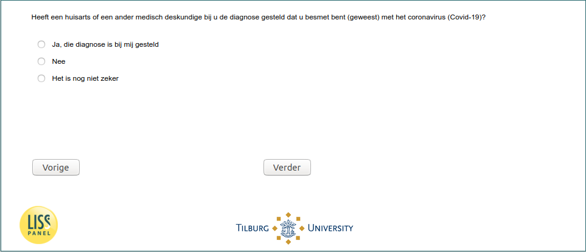

.. _w5e-InfectionDiagnosed: 

 
 .. role:: raw-html(raw) 
        :format: html 
 
`InfectionDiagnosed` – InfectionDiagnosed
============================================================== 

:raw-html:`←` :ref:`w5e-intro` | :ref:`w5e-q1header` :raw-html:`→` 
 

Has a general practitioner or other medical professional diagnosed that you are or have been infected with the coronavirus (Covid-19)?
 
.. csv-table:: 
   :delim: | 
   :header: yes I have been diagnosed with it,no,unsure
 
           :raw-html:`❏`|:raw-html:`❏`|:raw-html:`❏` 

:raw-html:`←` :ref:`w5e-intro` | :ref:`w5e-q1header` :raw-html:`→` 
 
