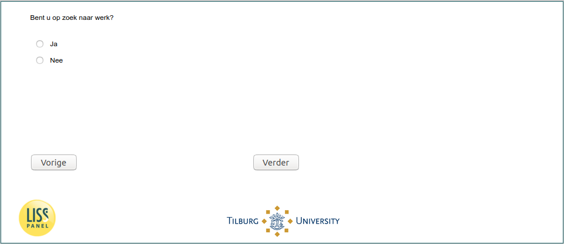

.. _w5e-JobSearch: 

 
 .. role:: raw-html(raw) 
        :format: html 
 
`JobSearch` – Unemployed – Looking for job
====================================================== 

:raw-html:`&larr;` :ref:`w5e-beliefs5` | :ref:`w5e-DifferentJobs` :raw-html:`&rarr;` 
 
*Routing to the question depends on answer in:* :ref:`w5e-EmploymentStatus and job_before` 

Are you looking for work?
 
.. csv-table:: 
   :delim: | 
   :header: yes,no
 
           :raw-html:`&#10063;`|:raw-html:`&#10063;` 

:raw-html:`&larr;` :ref:`w5e-beliefs5` | :ref:`w5e-DifferentJobs` :raw-html:`&rarr;` 
 
