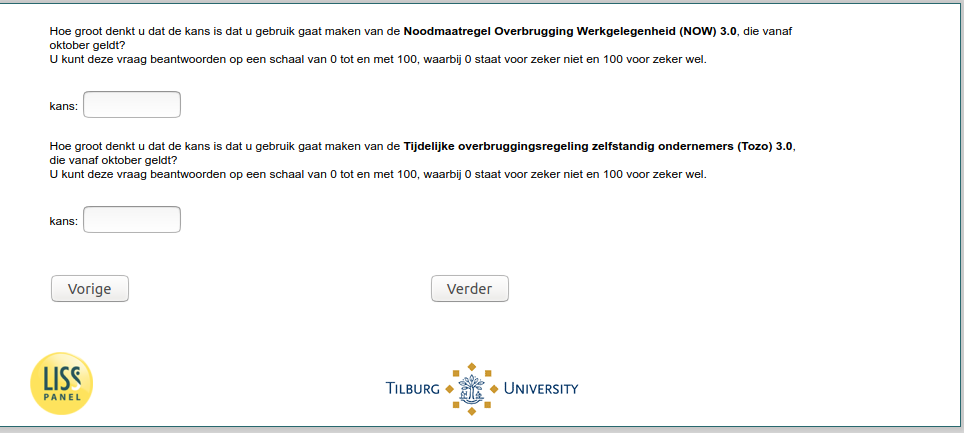

.. _w5e-NOW_ES2: 

 
 .. role:: raw-html(raw) 
        :format: html 
 
`NOW_ES2` – NOW 3.0 expectations among Self-Employed
============================================================== 

:raw-html:`&larr;` :ref:`w5e-NOW_ES1` | :ref:`w5e-change_empl` :raw-html:`&rarr;` 
 
*Routing to the question depends on answer in:* :ref:`w5e-EmploymentStatus` 

nan
 
.. csv-table:: 
   :delim: | 
 
           How big do you think the chances are that you will make use of the Emergency Measure? Bridging Employment (NOW) 3.0, applicable from October?
You can answer this question on a scale from 0 to 100, where 0 says for sure not and 100 for sure yes. | :raw-html:`<form><input type="text" id="fname" name="fname"> </form>` 
           How big do you think the chances are that you will make use of the Temporary bridging scheme for independent entrepreneurs (Tozo) 3.0, which applies from October?
You can answer this question on a scale from 0 to 100, where 0 stands for definitely not and 100 for definitely yes. | :raw-html:`<form><input type="text" id="fname" name="fname"> </form>` 

:raw-html:`&larr;` :ref:`w5e-NOW_ES1` | :ref:`w5e-change_empl` :raw-html:`&rarr;` 
 
