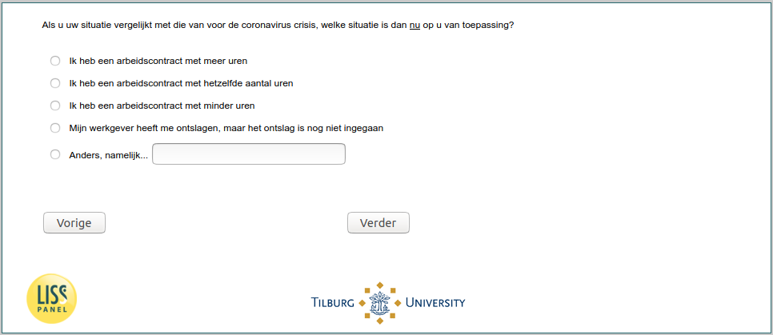

.. _w5e-change_empl: 

 
 .. role:: raw-html(raw) 
        :format: html 
 
`change_empl` – Income Situation (Employees)
========================================================== 

:raw-html:`&larr;` :ref:`w5e-NOW_ES2` | :ref:`w5e-change_selfempl` :raw-html:`&rarr;` 
 
*Routing to the question depends on answer in:* :ref:`w5e-EmploymentStatus` 

If you compare your situation with that before the coronavirus crisis, which situation applies to you now?
 
:raw-html:`&#10063;` – I have an employment contract with more hours
 
:raw-html:`&#10063;` – I have an employment contract with the same number of hour
 
:raw-html:`&#10063;` – I have an employment contract with fewer hours
 
:raw-html:`&#10063;` – I have an employment contract with fewer hours
 
:raw-html:`&#10063;` – other
 

:raw-html:`&larr;` :ref:`w5e-NOW_ES2` | :ref:`w5e-change_selfempl` :raw-html:`&rarr;` 
 
