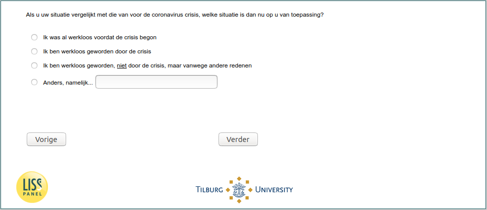

.. _w5e-change_unempl: 

 
 .. role:: raw-html(raw) 
        :format: html 
 
`change_unempl` – Income Situation (Unemployed)
=============================================================== 

:raw-html:`&larr;` :ref:`w5e-change_selfempl` | :ref:`w5e-job_before` :raw-html:`&rarr;` 
 
*Routing to the question depends on answer in:* :ref:`w5e-EmploymentStatus` 

If you compare your situation with that before the coronavirus crisis, which situation applies to you now?
 
:raw-html:`&#10063;` – I was unemployed before the crisis started
 
:raw-html:`&#10063;` – I have become unemployed because of the crisis
 
:raw-html:`&#10063;` – I became unemployed, not because of the crisis, but because of other reasons
 
:raw-html:`&#10063;` – Otherwise, namely...
 

:raw-html:`&larr;` :ref:`w5e-change_selfempl` | :ref:`w5e-job_before` :raw-html:`&rarr;` 
 
