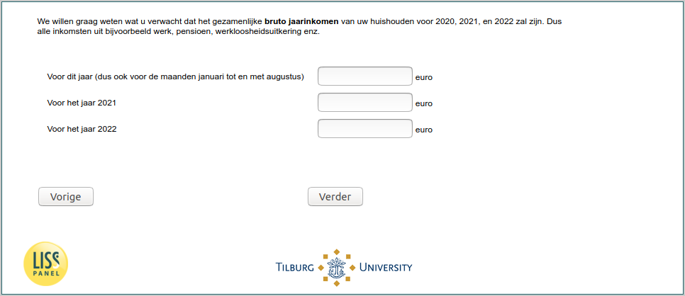

.. _w5e-expectedincome: 

 
 .. role:: raw-html(raw) 
        :format: html 
 
`expectedincome` – Expected Income
=================================================== 

:raw-html:`&larr;` :ref:`w5e-income` | :ref:`w5e-ExpUnempl_today` :raw-html:`&rarr;` 
 

We would like to know what you expect [if (p_numberhh = 1): your gross annual income/ if (p_numberhh ≠ 1): the combined gross annual income of your household] for 2020, 2021, and 2022 will be. So all income from, for example, work, pension, unemployment benefit, etc., will be your household gross annual income.
 
.. csv-table:: 
   :delim: | 
 
           For this year (so also for the months January to August) | :raw-html:`<form><input type="text" id="fname" name="fname"> </form>` 
           For the year 2021 | :raw-html:`<form><input type="text" id="fname" name="fname"> </form>` 
           For the year 2022 | :raw-html:`<form><input type="text" id="fname" name="fname"> </form>` 

:raw-html:`&larr;` :ref:`w5e-income` | :ref:`w5e-ExpUnempl_today` :raw-html:`&rarr;` 
 
