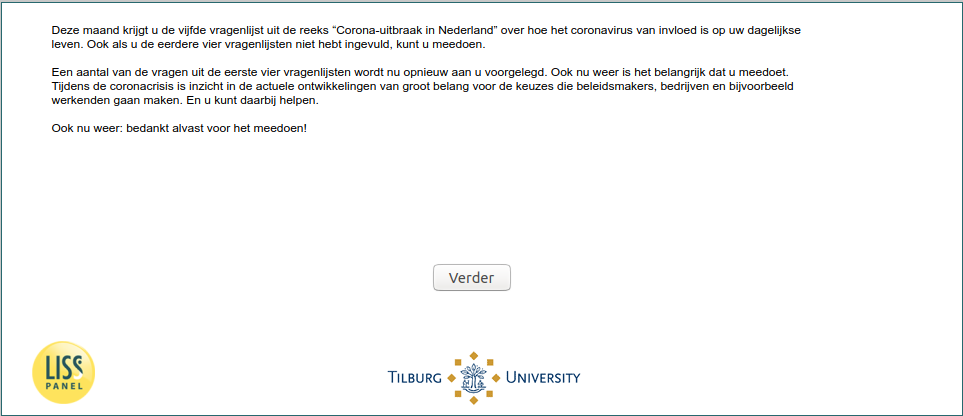

.. _w5e-intro: 

 
 .. role:: raw-html(raw) 
        :format: html 
 
`intro` – Introduction
============================== 

:ref:`w5e-InfectionDiagnosed` :raw-html:`→` 
 

This month you will receive the fifth questionnaire from the series "Corona outbreak in the Netherlands" on how the coronavirus affects your daily life. Even if you have not completed the previous four questionnaires, you can participate.

Some of the questions from the first four questionnaires will now be presented to you again. Again, it is important that you participate. During the corona crisis, insight into current developments is of great importance for the choices that policymakers, companies and, for example, employees are going to make. And you can help.

Once again: thank you for participating! 
 

:ref:`w5e-InfectionDiagnosed` :raw-html:`→` 
 
