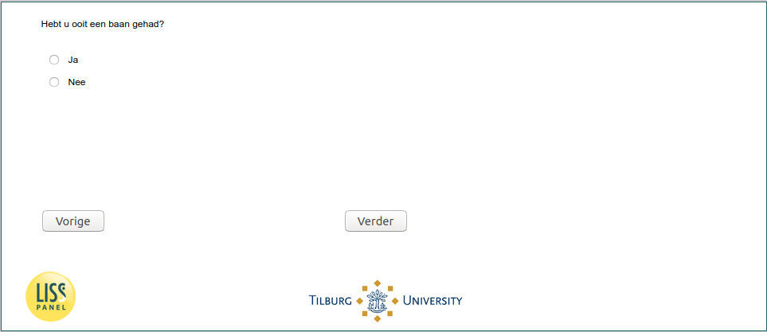

.. _w5e-job_before: 

 
 .. role:: raw-html(raw) 
        :format: html 
 
`job_before` – Unemployed - Job Before
=================================================== 

:raw-html:`&larr;` :ref:`w5e-change_unempl` | :ref:`w5e-beliefs1` :raw-html:`&rarr;` 
 
*Routing to the question depends on answer in:* :ref:`w5e-EmploymentStatus and leeftijd` 

Have you ever had a job?
 
.. csv-table:: 
   :delim: | 
   :header: yes|no
 
           :raw-html:`&#10063;`|:raw-html:`&#10063;` 

:raw-html:`&larr;` :ref:`w5e-change_unempl` | :ref:`w5e-beliefs1` :raw-html:`&rarr;` 
 
