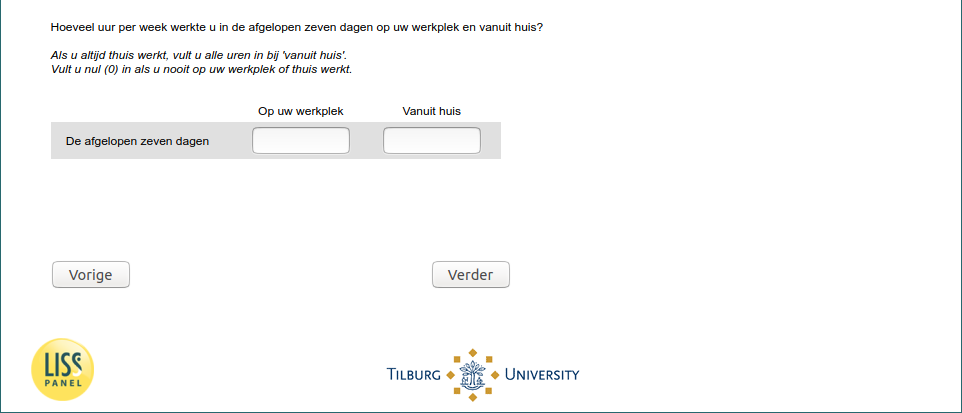

.. _w5e-q14: 

 
 .. role:: raw-html(raw) 
        :format: html 
 
`q14` – Work Time Remote and Workplace
============================================ 

:raw-html:`&larr;` :ref:`w5e-EmploymentStatus` | :ref:`w5e-vacsick` :raw-html:`&rarr;` 
 
*Routing to the question depends on answer in:* :ref:`w5e-EmploymentStatus` 

How many hours per week have you worked in your workplace and from home in the past seven days? 

If you always work from home, fill in all hours at 'from home'.
Fill in zero (0) if you never work at your workplace or at home.
 
.. csv-table:: 
   :delim: | 
 
           At your workplace | :raw-html:`<form><input type="text" id="fname" name="fname"> </form>` 
           From home | :raw-html:`<form><input type="text" id="fname" name="fname"> </form>` 

:raw-html:`&larr;` :ref:`w5e-EmploymentStatus` | :ref:`w5e-vacsick` :raw-html:`&rarr;` 
 
