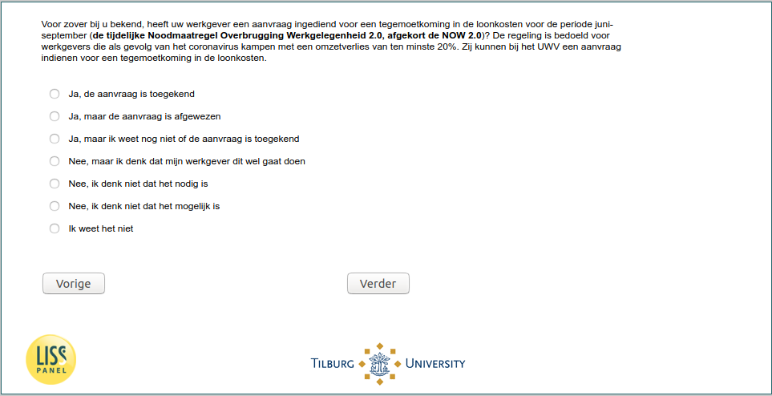

.. _w5e-q16a: 

 
 .. role:: raw-html(raw) 
        :format: html 
 
`q16a` – NOW
=================== 

:raw-html:`&larr;` :ref:`w5e-vacsick` | :ref:`w5e-q17a` :raw-html:`&rarr;` 
 
*Routing to the question depends on answer in:* :ref:`w5e-EmploymentStatus` 

To the best of your knowledge, has your employer submitted an application for an allowance for labour costs for the period June-September (the temporary Emergency Measure Bridging Employment 2.0, abbreviated to NOW 2.0)? The scheme is intended for employers who suffer a loss of turnover of at least 20% due to the coronavirus. They can apply to the UWV for an allowance for labour costs.
 
.. csv-table:: 
   :delim: | 
   :header: yes the application has been granted,yes but the application was rejected,yes but I don't yet know if the application has been granted,no I don't think it's necessary,no but I think my employer is gonna do this,no I don't think it's possible,I don't know 
 
           :raw-html:`&#10063;`|:raw-html:`&#10063;`|:raw-html:`&#10063;`|:raw-html:`&#10063;`|:raw-html:`&#10063;`|:raw-html:`&#10063;`|:raw-html:`&#10063;` 

:raw-html:`&larr;` :ref:`w5e-vacsick` | :ref:`w5e-q17a` :raw-html:`&rarr;` 
 
