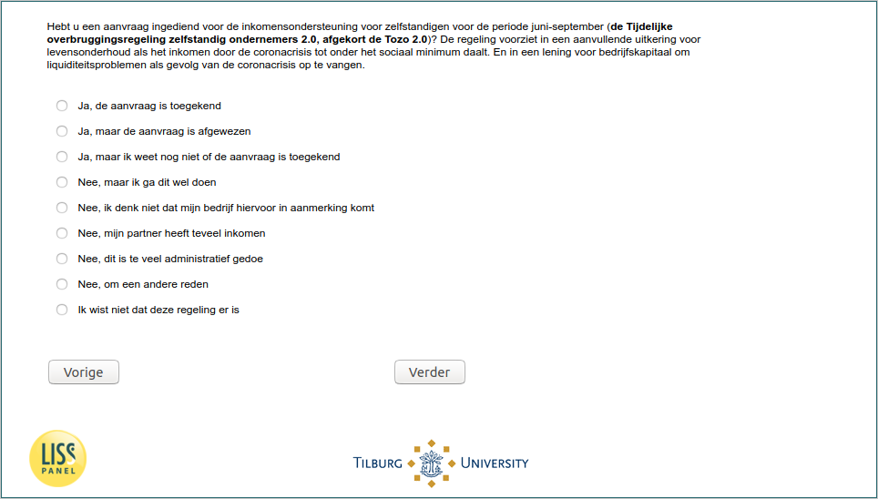

.. _w5e-q17d: 

 
 .. role:: raw-html(raw) 
        :format: html 
 
`q17d` – Tozo among Self-Employed
======================================== 

:raw-html:`←` :ref:`w5e-q17a` | :ref:`w5e-NOW_ES1` :raw-html:`→` 
 
*Routing to the question depends on answer in:* :ref:`w5e-EmploymentStatus` 

Have you submitted an application for income support for self-employed persons for the period June-September (the Temporary bridging scheme for self-employed persons 2.0, abbreviated to Tozo 2.0)? The scheme provides a supplementary livelihood allowance if the income falls below the social minimum due to the corona crisis. And a loan for working capital to absorb liquidity problems as a result of the corona crisis.
 
.. csv-table:: 
   :delim: | 
   :header: yes the application has been granted,yes but the application was rejected,yes but I don't yet know if the application has been granted,no but I'm gonna do this,no I don't think my company qualifies,no my partner has too much income,no this is too much paperwork,no for another reason,I didn't know there was this arrangement
 
           :raw-html:`❏`|:raw-html:`❏`|:raw-html:`❏`|:raw-html:`❏`|:raw-html:`❏`|:raw-html:`❏`|:raw-html:`❏`|:raw-html:`❏`|:raw-html:`❏` 

:raw-html:`←` :ref:`w5e-q17a` | :ref:`w5e-NOW_ES1` :raw-html:`→` 
 
