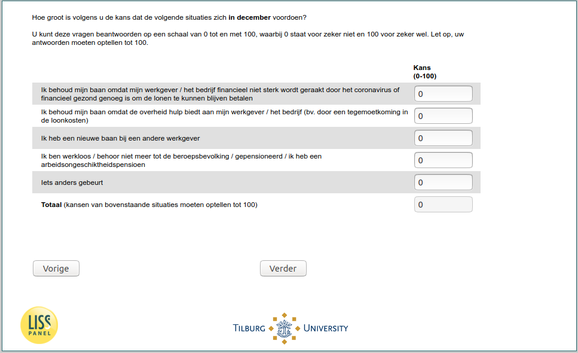

.. _w5e-q26: 

 
 .. role:: raw-html(raw) 
        :format: html 
 
`q26` – Expectations December among Employed
================================================== 

:raw-html:`&larr;` :ref:`w5e-SearchingTraining` | :ref:`w5e-q26header_1` :raw-html:`&rarr;` 
 
*Routing to the question depends on answer in:* :ref:`w5e-EmploymentStatus` 

In your opinion, what are the chances of the following situations occurring in December? 
You can answer these questions on a scale from 0 to 100, where 0 stands for definitely not and 100 for definitely yes. Please note that your answers must add up to 100. 
 
.. csv-table:: 
   :delim: | 
 
           I keep my job because my employer / company is not financially affected by the coronavirus or is financially healthy enough to continue to pay the wages | :raw-html:`<form><input type="text" id="fname" name="fname"> </form>` 
           I keep my job because the government offers help to my employer / company (e.g. through an allowance for wage costs). | :raw-html:`<form><input type="text" id="fname" name="fname"> </form>` 
           I have a new job with another employer | :raw-html:`<form><input type="text" id="fname" name="fname"> </form>` 
           I am unemployed / no longer part of the labour force / retired / I have a disability pension | :raw-html:`<form><input type="text" id="fname" name="fname"> </form>` 
           Something else happens | :raw-html:`<form><input type="text" id="fname" name="fname"> </form>` 

:raw-html:`&larr;` :ref:`w5e-SearchingTraining` | :ref:`w5e-q26header_1` :raw-html:`&rarr;` 
 
