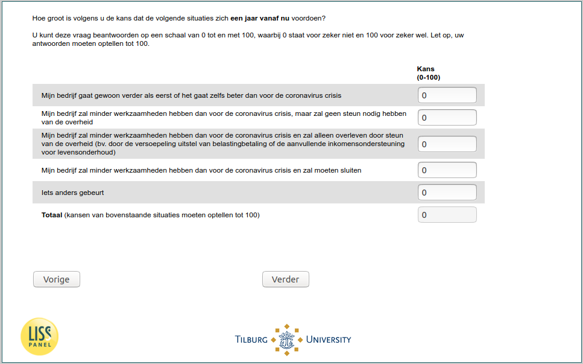

.. _w5e-q27header_1: 

 
 .. role:: raw-html(raw) 
        :format: html 
 
`q27header_1` – Expectations Next Year among Self-Employed
======================================================================== 

:raw-html:`&larr;` :ref:`w5e-q27header` | :ref:`w5e-q27header_ex` :raw-html:`&rarr;` 
 
*Routing to the question depends on answer in:* :ref:`w5e-EmploymentStatus` 

In your opinion, what are the chances of the following situations occurring a year from now?
You can answer these questions on a scale from 0 to 100, where 0 stands for definitely not and 100 for definitely yes. Please note that your answers must add up to 100.
 
.. csv-table:: 
   :delim: | 
 
           My business continues as before or even better than before the coronavirus crisis | :raw-html:`<form><input type="text" id="fname" name="fname"> </form>` 
           My company will have less work than before the coronavirus crisis, but will not need government support | :raw-html:`<form><input type="text" id="fname" name="fname"> </form>` 
           My company will have less work than before the coronavirus crisis and will survive only through government support (e.g. by relaxing tax deferrals or additional income support for livelihoods). | :raw-html:`<form><input type="text" id="fname" name="fname"> </form>` 
           My company will have less work than before the coronavirus crisis and will have to close down | :raw-html:`<form><input type="text" id="fname" name="fname"> </form>` 
           Something else happens | :raw-html:`<form><input type="text" id="fname" name="fname"> </form>` 

:raw-html:`&larr;` :ref:`w5e-q27header` | :ref:`w5e-q27header_ex` :raw-html:`&rarr;` 
 
