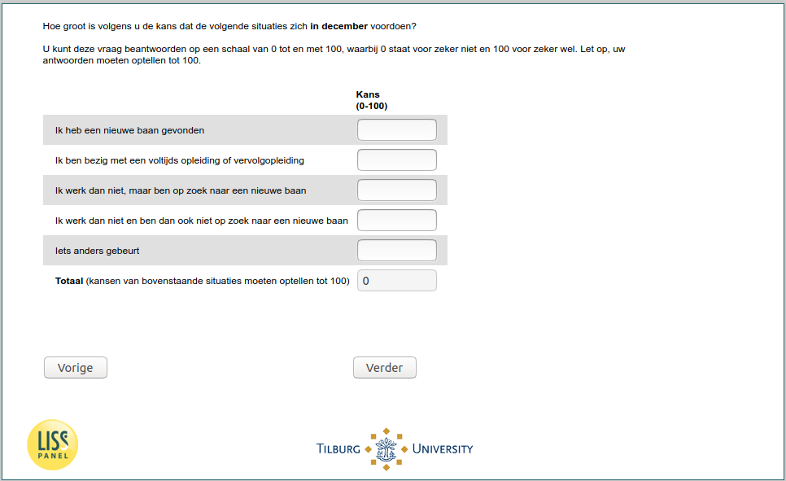

.. _w5e-q27header_ex: 

 
 .. role:: raw-html(raw) 
        :format: html 
 
`q27header_ex` – Expectations December among Unemployed
====================================================================== 

:raw-html:`&larr;` :ref:`w5e-q27header_1` | :ref:`w5e-q27header_ex_1` :raw-html:`&rarr;` 
 
*Routing to the question depends on answer in:* :ref:`w5e-EmploymentStatus` 

In your opinion, what are the chances of the following situations occurring in December? 
You can answer these questions on a scale from 0 to 100, where 0 stands for definitely not and 100 for definitely yes. Please note that your answers must add up to 100. 
 
.. csv-table:: 
   :delim: | 
 
           I've found a new job | :raw-html:`<form><input type="text" id="fname" name="fname"> </form>` 
           I am in full-time education or continuing education | :raw-html:`<form><input type="text" id="fname" name="fname"> </form>` 
           I'm not working then, but I'm looking for a new job | :raw-html:`<form><input type="text" id="fname" name="fname"> </form>` 
           I'm not working then and I'm not looking for a new job | :raw-html:`<form><input type="text" id="fname" name="fname"> </form>` 
           Something else happens | :raw-html:`<form><input type="text" id="fname" name="fname"> </form>` 

:raw-html:`&larr;` :ref:`w5e-q27header_1` | :ref:`w5e-q27header_ex_1` :raw-html:`&rarr;` 
 
