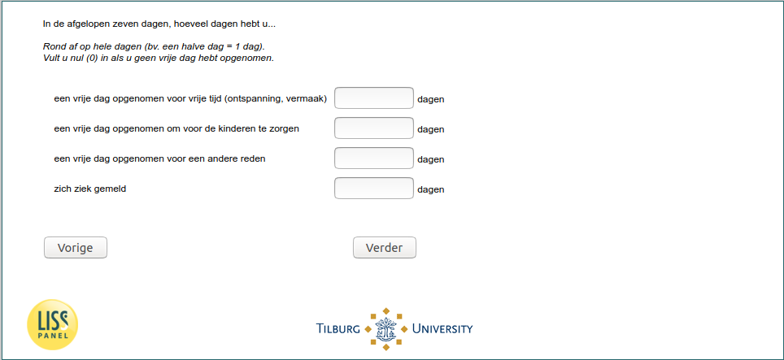

.. _w5e-vacsick: 

 
 .. role:: raw-html(raw) 
        :format: html 
 
`vacsick` – Vacation & Sickness
========================================= 

:raw-html:`&larr;` :ref:`w5e-q14` | :ref:`w5e-q16a` :raw-html:`&rarr;` 
 
*Routing to the question depends on answer in:* :ref:`w5e-EmploymentStatus` 

In the past seven days, how many days have you...  

Round off on whole days (e.g. half a day = 1 day).
Fill in zero (0) if you haven't taken a day off.
 
.. csv-table:: 
   :delim: | 
 
           taken a day off for leisure (relaxation, entertainment) | :raw-html:`<form><input type="text" id="fname" name="fname"> </form>` 
           taken a day off to take care of the children | :raw-html:`<form><input type="text" id="fname" name="fname"> </form>` 
           taken a day off for another reason | :raw-html:`<form><input type="text" id="fname" name="fname"> </form>` 
           reported sick | :raw-html:`<form><input type="text" id="fname" name="fname"> </form>` 

:raw-html:`&larr;` :ref:`w5e-q14` | :ref:`w5e-q16a` :raw-html:`&rarr;` 
 
