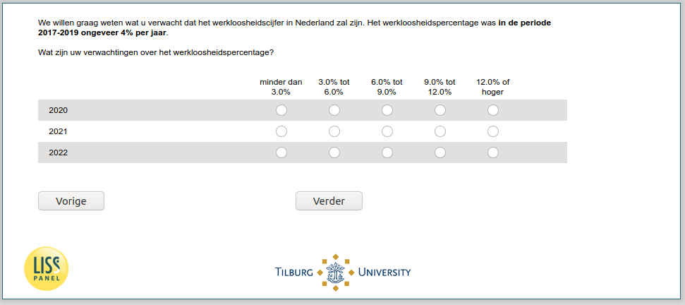

.. _w6d-ExpEcGrowth_today: 

 
 .. role:: raw-html(raw) 
        :format: html 
 
`ExpEcGrowth_today` – Expected Economic Growth Today
======================================================================== 

:raw-html:`&larr;` :ref:`w6d-ExpUnempl_today` | :ref:`w6d-ExpInfl_today` :raw-html:`&rarr;` 
 

We willen graag weten wat u verwacht dat de groei van de economie in Nederland zal zijn.
De economische groei, dat wil zeggen, de verandering van de hoeveelheid goederen en diensten die Nederland kan gebruiken, was in de periode 2017-2019 ongeveer 2,5% per jaar.
Wat zijn uw verwachtingen over de economische groei?
 
.. csv-table:: 
   :delim: | 
   :header: ,minder dan -6% ,-6% tot -4% ,-4% tot -2% ,-2% tot 0% ,0% tot 2% ,2% tot 4% ,4% of hoger
 
           2020 | :raw-html:`&#10063;`|:raw-html:`&#10063;`|:raw-html:`&#10063;`|:raw-html:`&#10063;`|:raw-html:`&#10063;`|:raw-html:`&#10063;`|:raw-html:`&#10063;` 
           2021 | :raw-html:`&#10063;`|:raw-html:`&#10063;`|:raw-html:`&#10063;`|:raw-html:`&#10063;`|:raw-html:`&#10063;`|:raw-html:`&#10063;`|:raw-html:`&#10063;` 
           2022 | :raw-html:`&#10063;`|:raw-html:`&#10063;`|:raw-html:`&#10063;`|:raw-html:`&#10063;`|:raw-html:`&#10063;`|:raw-html:`&#10063;`|:raw-html:`&#10063;` 

:raw-html:`&larr;` :ref:`w6d-ExpUnempl_today` | :ref:`w6d-ExpInfl_today` :raw-html:`&rarr;` 
 
