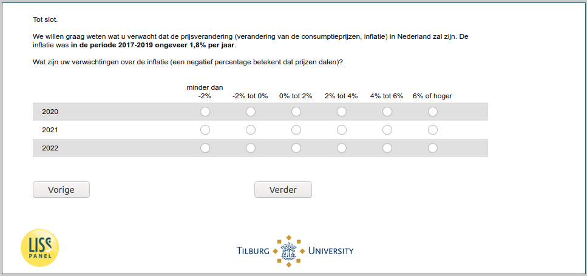

.. _w6d-ExpInfl_today: 

 
 .. role:: raw-html(raw) 
        :format: html 
 
`ExpInfl_today` – Expected Inflation Today
========================================================== 

:raw-html:`&larr;` :ref:`w6d-ExpEcGrowth_today` 
 

We willen graag weten wat u verwacht dat de prijsverandering (verandering van de consumptieprijzen, inflatie) in Nederland zal zijn. De inflatie was in de periode 2017-2019 ongeveer 1,8% per jaar.

Wat zijn uw verwachtingen over de inflatie (een negatief percentage betekent dat prijzen dalen)?
 
.. csv-table:: 
   :delim: | 
   :header: ,minder dan -2% ,-2% tot 0% ,0% tot 2% ,2% tot 4% ,4% tot 6% ,6% of hoger
 
           2020 | :raw-html:`&#10063;`|:raw-html:`&#10063;`|:raw-html:`&#10063;`|:raw-html:`&#10063;`|:raw-html:`&#10063;`|:raw-html:`&#10063;` 
           2021 | :raw-html:`&#10063;`|:raw-html:`&#10063;`|:raw-html:`&#10063;`|:raw-html:`&#10063;`|:raw-html:`&#10063;`|:raw-html:`&#10063;` 
           2022 | :raw-html:`&#10063;`|:raw-html:`&#10063;`|:raw-html:`&#10063;`|:raw-html:`&#10063;`|:raw-html:`&#10063;`|:raw-html:`&#10063;` 

:raw-html:`&larr;` :ref:`w6d-ExpEcGrowth_today` 
 
