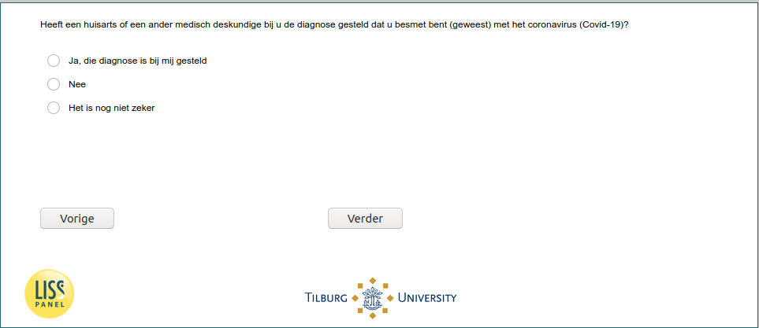

.. _w6d-InfectionDiagnosed: 

 
 .. role:: raw-html(raw) 
        :format: html 
 
`InfectionDiagnosed` – Infection Diagnosed
=============================================================== 

:raw-html:`&larr;` :ref:`w6d-intro` | :ref:`w6d-q1header` :raw-html:`&rarr;` 
 

Heeft een huisarts of een ander medisch deskundige bij u de diagnose gesteld dat u besmet bent (geweest) met het coronavirus (Covid-19)?

:raw-html:`&#10063;` – Ja die diagnose is bij mij gesteld

:raw-html:`&#10063;` – Nee

:raw-html:`&#10063;` – Het is nog niet zeker

:raw-html:`&larr;` :ref:`w6d-intro` | :ref:`w6d-q1header` :raw-html:`&rarr;` 
 
