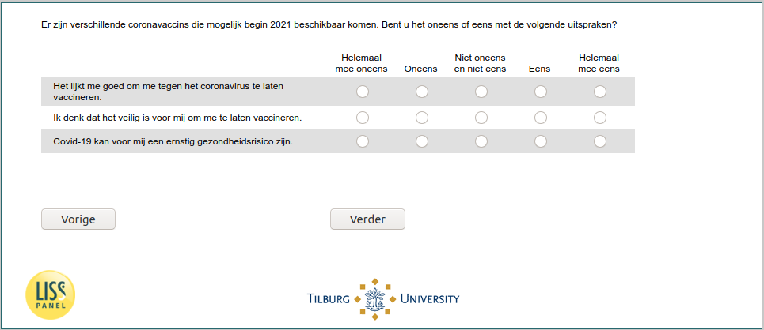

.. _w6d-covid_attitudes: 

 
 .. role:: raw-html(raw) 
        :format: html 
 
`covid_attitudes` – COVID Attitudes
===================================================== 

:raw-html:`←` :ref:`w6d-vaccine_intention_jul` | :ref:`w6d-covid_test_prob1` :raw-html:`→` 
 

Er zijn verschillende coronavaccins die mogelijk begin 2021 beschikbaar komen. Bent u het oneens of eens met de volgende uitspraken?
 
.. csv-table:: 
   :delim: | 
   :header: ,Helemaal mee oneens,Oneens,Niet oneens en niet eens,Eens,Helemaal mee eens
 
           Het lijkt me goed om me tegen het coronavirus te laten vaccineren. | :raw-html:`❏`|:raw-html:`❏`|:raw-html:`❏`|:raw-html:`❏`|:raw-html:`❏` 
           Ik denk dat het veilig is voor mij om me te laten vaccineren. | :raw-html:`❏`|:raw-html:`❏`|:raw-html:`❏`|:raw-html:`❏`|:raw-html:`❏` 
           Covid-19 kan voor mij een ernstig gezondheidsrisico zijn. | :raw-html:`❏`|:raw-html:`❏`|:raw-html:`❏`|:raw-html:`❏`|:raw-html:`❏` 

:raw-html:`←` :ref:`w6d-vaccine_intention_jul` | :ref:`w6d-covid_test_prob1` :raw-html:`→` 
 
