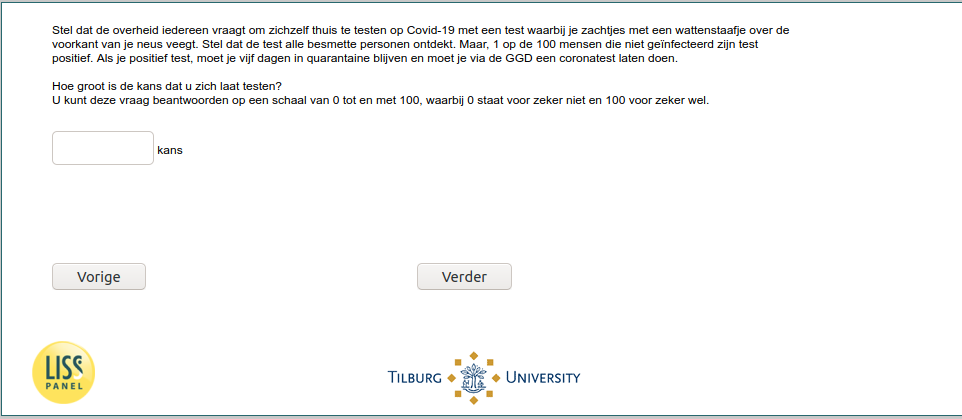

.. _w6d-covid_test_prob1: 

 
 .. role:: raw-html(raw) 
        :format: html 
 
`covid_test_prob1` – Test Probabilities – 1
============================================================== 

:raw-html:`&larr;` :ref:`w6d-covid_attitudes` | :ref:`w6d-covid_test_prob2` :raw-html:`&rarr;` 
 

Stel dat de overheid iedereen vraagt om zichzelf thuis te testen op Covid-19 met een test waarbij je zachtjes met een wattenstaafje over de voorkant van je neus veegt. Stel dat de test alle besmette personen ontdekt. Maar, 1 op de 100 mensen die niet geïnfecteerd zijn test positief. Als je positief test, moet je vijf dagen in quarantaine blijven en moet je via de GGD een coronatest laten doen.

Hoe groot is de kans dat u zich laat testen?
U kunt deze vraag beantwoorden op een schaal van 0 tot en met 100, waarbij 0 staat voor zeker niet en 100 voor zeker wel. 
 

:raw-html:`&larr;` :ref:`w6d-covid_attitudes` | :ref:`w6d-covid_test_prob2` :raw-html:`&rarr;` 
 
