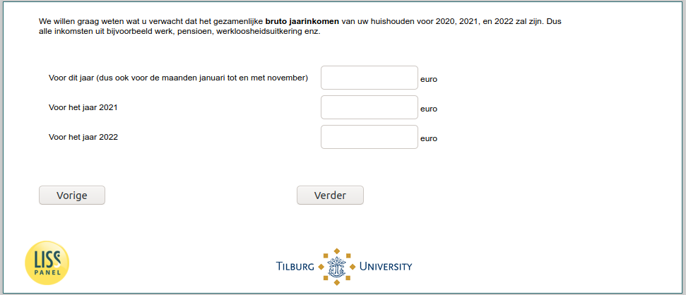

.. _w6d-expinc2020: 

 
 .. role:: raw-html(raw) 
        :format: html 
 
`expinc2020` – Expected Income
=========================================== 

:raw-html:`&larr;` :ref:`w6d-inc` | :ref:`w6d-ExpUnempl_today` :raw-html:`&rarr;` 
 

We willen graag weten wat u verwacht dat [if (p_aantalhh = 1): uw bruto jaarinkomen/ if (p_aantalhh ≠ 1): het gezamenlijke bruto jaarinkomen van uw huishouden] voor 2020, 2021, en 2022 zal zijn. Dus alle inkomsten uit bijvoorbeeld werk, pensioen, werkloosheidsuitkering enz.
 
.. csv-table:: 
   :delim: | 
 
           Voor dit jaar (dus ook voor de maanden januari tot en met november) | :raw-html:`<form><input type="text" id="fname" name="fname"> </form>` 
           Voor het jaar 2021 | :raw-html:`<form><input type="text" id="fname" name="fname"> </form>` 
           Voor het jaar 2022 | :raw-html:`<form><input type="text" id="fname" name="fname"> </form>` 

:raw-html:`&larr;` :ref:`w6d-inc` | :ref:`w6d-ExpUnempl_today` :raw-html:`&rarr;` 
 
